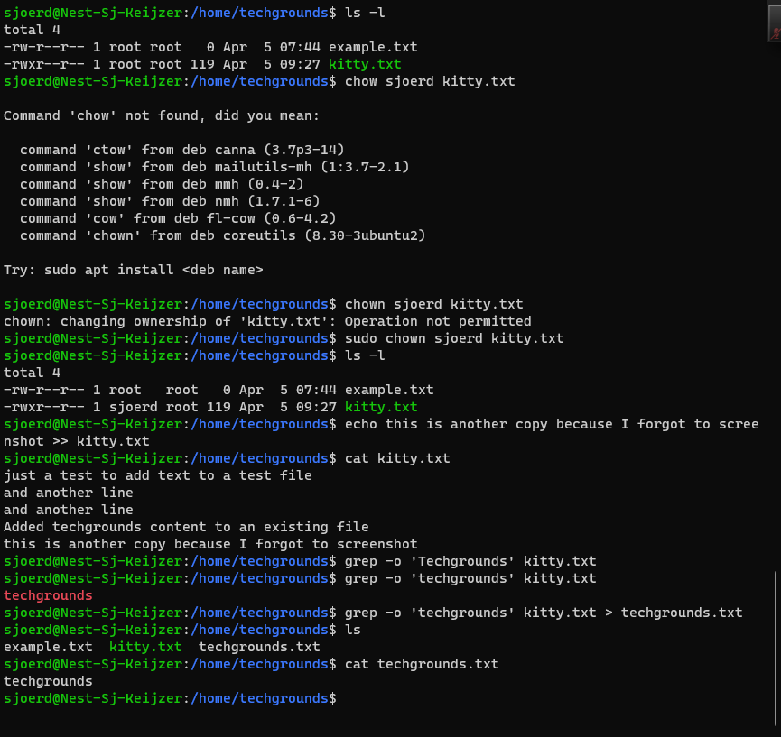

# Werken met een CLI
Werken met een CLI

## Key-terms
CLI staat voor Command Line Interface. 

Standard input/output (stdin - stdout). Stdin is vrijwel altijd keyboard waarmee je de commanda's runned. Stdout is dan altijd de terminal 

Redirect - Je kan de stdin en stdout veranderen met zgm input en output redirection. Voorbeeld van output redirection in linux is dit met `command > file.txt` of als je niet wilt overwriten `command >> file.txt` 

## Opdracht
- Gebruik Echo command en output redirection om nieuwe zin te schrijven in een text file met gebruik van CLI. De nieuwe zin moet het woord 'techgrounds' bevatten
- Gebruik een commando om de content van de text file naar de terminal te schrijven. Maak gebruik van een commando om de output zo te filteren dat van de zin alleen de zin met techgrounds verschijnt. 
- Lees de text file uit met het commando wat je in stap 2 hebt gebruikt, weer gefilterd voor het woord 'techgrounds'. Deze keer redirect de output naar een nieuwe tekstfile genaamd 'techgrounds.txt' 

### Gebruikte bronnen
- https://www.hostinger.com/tutorials/what-is-cli
- https://www.tecmint.com/echo-command-in-linux/
- https://www.geeksforgeeks.org/echo-command-in-linux-with-examples/
- https://www.guru99.com/linux-redirection.html
- https://www.digitalocean.com/community/tutorials/an-introduction-to-linux-i-o-redirection
- https://pubs.opengroup.org/onlinepubs/009696899/utilities/grep.html
man grep

### Ervaren problemen
Omdat ik af wilde dat ik voor iedere command sudo of als root moest zijn inlogd, heb ik met permissions rond zitten te kloten. Dit heeft me ongeveer de gehele woensdag gekost. Ik heb met chmod proberen mezelf meer user rechten te geven en uiteindelijk de folder van techgrounds en ook de file kitty.txt die daar in stond. Ik heb daar een foutje in gemaakt en toen kon ik als user niet meer /home/techgrounds zien.  

Uiteindelijk met hulp van Curt gevonden dat chown bestaat en dat heeft me gered. Ik heb vervolgens chown gebruikt om me zelf voor de goede files rechten te geven zonder dat ik steeds paardenmiddel root moest gebruiken. Dat was het moeilijkste deze, het echo/cat gedeelte was vrij simpel. Grep command had ik snel gevonden, maar moest wel even zoeken naar de juiste identifier om te filteren. -o stond niet wijdverspreid op het internet, terwijl ik die wel nodig had. Uiteindelijk via man grep (manual for grep) kunnnen vinden in Powershell.

### Resultaat
