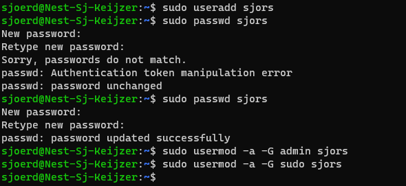
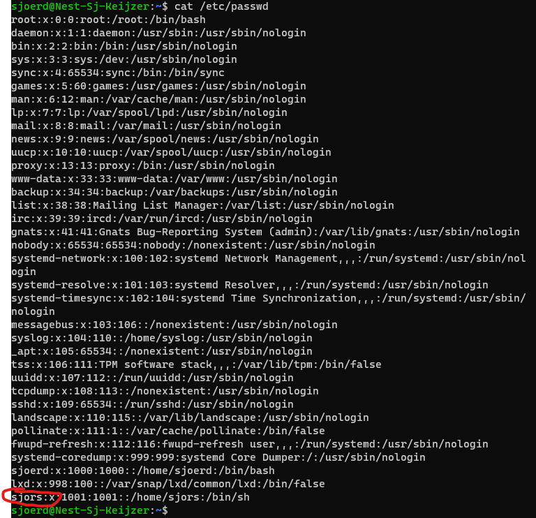
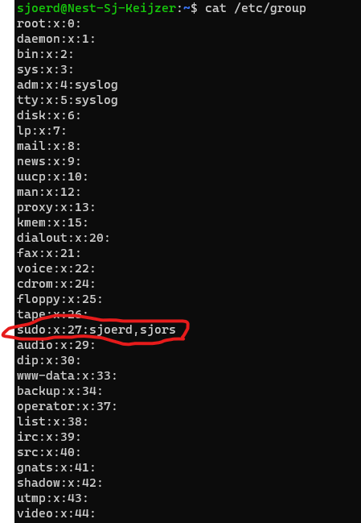
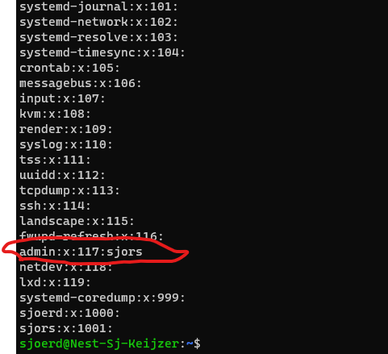

# LNX-04 nieuwe user & permissions
Aan maken van nieuwe user en deze de juiste rechten geven en aan juiste groep(s) toewijzen.

## Key-terms

### Root
I am root. Dat zou de lijfspreuk kunnen zijn van een root user. Root mag en kan alles, dus het is wel raadzaam om niet iedereen root acces te geven.

### Sudo
Origineel 'Superuser do'. Superuser permissies dus super handig. Kan echter niet alles wat Root wel kan. Sudo rechten kan je dus wat makkelijker uitdelen aan mensen die je vertrouwd aka beheerders of admins. 

Als je de correcte rechten hebt kan je het commando 'sudo' gebruiken om tijdelijk bij dat commando 'run as administrator' idee toe te passen. Bijvoorbeeld `sudo useradd sjors`

Handige (en noodzakelijke) commands om nieuwe user mee aan te maken
`useradd
passwd
usermod`

### /etc/ mappen
Hier wordt eigenlijke alle configuratie, users en systeembestanden opgeslagen. Deze map dus niet zomaar klakkeloos deleten dus.  

## Opdracht
- Create a new user in your VM. 
- The new user should be part of an admin group.
- The new user should have a password.
- The new user should be able to use ‘sudo’
- Locate the files that store users, passwords, and groups. See if you can find your newly created user’s data in there.

### Gebruikte bronnen
- https://linuxize.com/post/how-to-create-users-in-linux-using-the-useradd-command/?utm_content=cmp-true
- https://www.howtogeek.com/50787/add-a-user-to-a-group-or-second-group-on-linux/
- https://www.redhat.com/sysadmin/linux-groups
- https://www.beyondtrust.com/blog/entry/unix-linux-privileged-management-should-you-sudo
- https://en.wikipedia.org/wiki/Sudo
- https://askubuntu.com/questions/611584/how-could-i-list-all-super-users
- https://stackoverflow.com/questions/12539272/grep-etc-passwd-and-etc-group-to-list-all-users-and-each-group-the-user-belong
- https://www.linux.com/training-tutorials/linux-directory-structure-explainedetc-folder/
- https://www.freecodecamp.org/news/grep-command-in-linux-usage-options-and-syntax-examples/#:~:text=Grep%20is%20a%20useful%20command,a%20powerful%20command%20to%20use.
- https://www.cyberciti.biz/faq/understanding-etcgroup-file/

### Ervaren problemen
Er zijn natuurlijk verschillende wegen naar Rome om een user aan te maken. -aG schijnt ook te kunnen bijvoorbeeld, maar omdat PowerShell verder niet moeilijk deed over -a -G die ik van een van de bronnen heb, heb ik het bij -a -G gelaten. Het was nog wel even zoeken waar precies de groupen in de mappen structuur stonden, maar gelukkig vrij snel achter gekomen dat dit in /etc/ was. De rest ging vrij soepel. 

Ben hier heel blij mee want na de afgelopen dagen had ik echt het gevoel dat ik er niks van kon. 

### Resultaat

In bovenstaande screenshots heb ik toevallig cat gebruikt om de groeps te 'openen' maar ik heb ook andere varianten uitgeprobeerd. 

`getent` en `grep` en `less` en `more` werken hier ook voor, maar bij 3/4 krijg je lekker lange lijsten. Ik kan het waarschijnlijk nog wel iets specificeren, maar voor mij werkt als je alleen iets wilt openen, `cat` het beste en als je iets wilt opzoeken vind ik `grep` het makkelijkste.  

For good measure:
