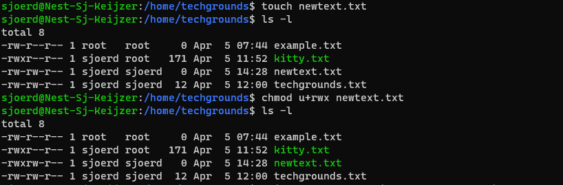
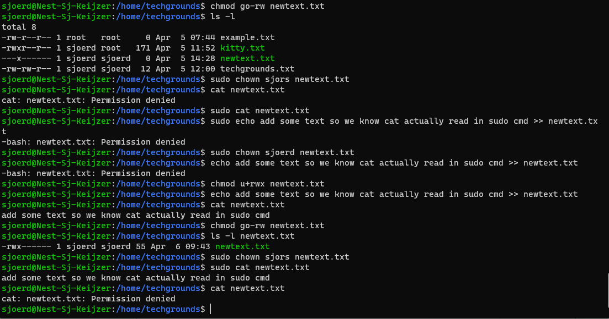
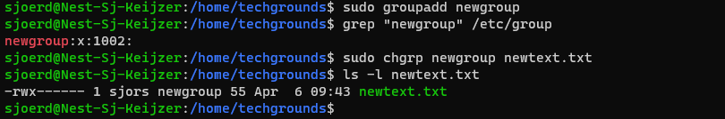

# LNX-05 Files en permissies
Permissies zijn belangrijk want die gaan over wat een user, bestand of applicatie allemaal wel (of niet) mag doen binnen een systeem.

## Key-terms
Omdat ik in het begin van de linux opdrachten al met mijn permissions zat te rommelen komen deze twee weer goed van pas: 

### chmod
Change modifier. De file kan je permissions geven/aanpassen/verwijderen
syntax is `chmod u=rwx filename` of `chmod -rw /pathname/voorbeeld`

### chown
Change owner. Je veranderd hiermee de owner van een file/map
syntax `chown username filename`

### groupadd
Voeg groep toe als `sudo groupadd groupname`

### chgrp
Change group. Hiermee verander je alleen de groep van een file/map
syntax `sudo chgrp groupname filename`

### rwx - read, write, execute rechten. 

### Long listing
ls -l en/of ls -la om lijst van rechten en owners te zien van de folders/files waar je nu in zit. a is hier toevoeging voor hidden files. 

## Opdracht
- Create a text file.
- Make a long listing to view the file’s permissions. Who is the file’s owner and group? What kind of permissions does the file have?
- Make the file executable by adding the execute permission (x).
- Remove the read and write permissions (rw) from the file for the group and everyone else, but not for the owner. Can you still read it?
- Change the owner of the file to a different user. If everything went well, you shouldn’t be able to read the file unless you assume root privileges with ‘sudo’.
- Change the group ownership of the file to a different group.

### Gebruikte bronnen
- https://askubuntu.com/questions/719996/how-can-i-give-full-permission-to-folder-and-subfolder
- https://stackoverflow.com/questions/23251963/how-do-i-change-file-permissions-in-ubuntu
- https://docs.rackspace.com/support/how-to/checking-linux-file-permissions-with-ls/
- https://devtutorial.io/how-to-set-permissions-on-files-and-directories-on-ubuntu-server-21-04-p2631.html?utm_content=cmp-true
- https://www.pluralsight.com/blog/it-ops/linux-file-permissions
- https://docs.rackspace.com/support/how-to/checking-linux-file-permissions-with-ls/
- https://linuxize.com/post/chgrp-command-in-linux/

### Ervaren problemen
Door eerdere problemen met permissies komen chmod en chown nu niet raar meer over. 

Wat nu beetje onhandig was voor de oefening is dat ik geen tekst in de newtext.txt had gezet, dus als je dan met cat cmd iets wil uitlezen zie je niks terug ondanks dat het wel werkt. Vandaar dat ik alle permissions weer eerst terug moest zetten, dan echo gebruikt om text toe te voegen met redirect en vervolgens de opdracht voltooid. 

### Resultaat

