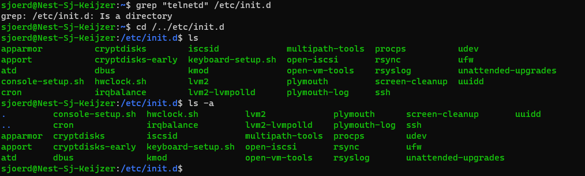
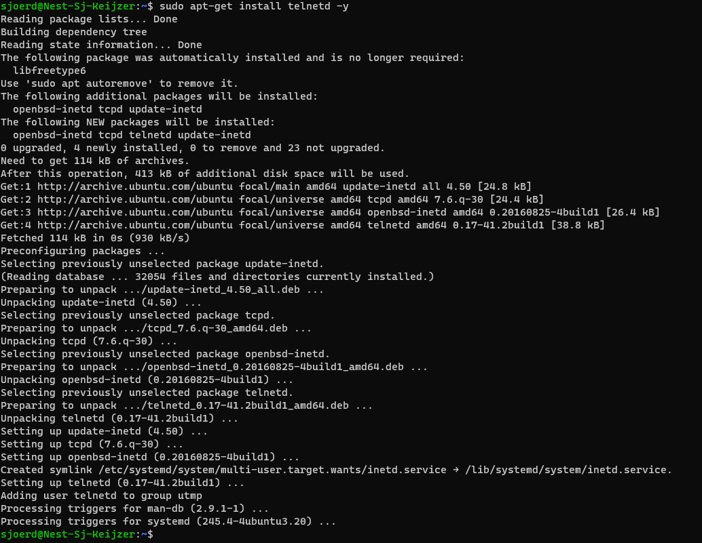
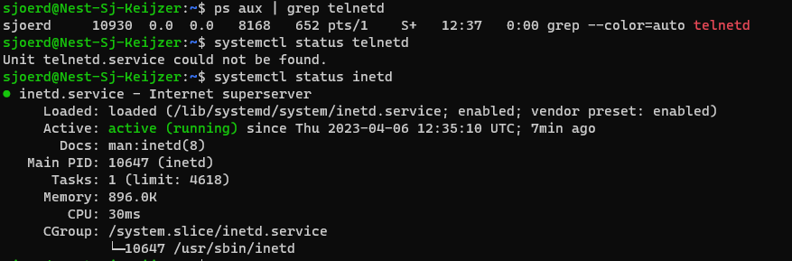
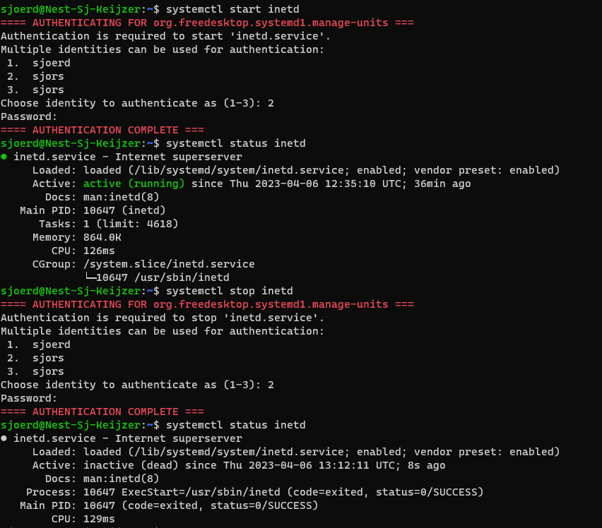

# LNX-06 Daemons, services & processen
Wat zijn daemons, wat doen ze en welke interactie hebben deze duiveltjes met bepaalde services en systeemprocessen.

## Key-terms

### Daemon
Een slapend achtergrond proces wat niet actief is.

Als ze ergens slapen dan zijn ze vaak te vinden in /etc/init.d

### PID
Process Identifier, kortweg process ID of PID. Het wordt gebruikt in Linux om unieke processen te kunnen identificeren. 

### Linux processen
- Batch : gaat via een process queue and is niet command line gerelateerd. 
- Interactive: dit process wordt door de user via de command line in gang gezet
- Daemon : Slaap bestand dat via een init (initiate) script tot leven gewekt kan worden. Als het actief is dan forked of cloned het zichzelf, waarna de childs hun ding kunnen doen en de parent (automatisch) kan worden afgesloten. 

### stop of kill process

## Opdracht
- Start the telnet daemon.
- Find out the PID of the telnet daemon.
- Find out how much memory telnetd is using.
- Stop or kill the telnetd process.

### Gebruikte bronnen
- https://www.javatpoint.com/linux-daemon#:~:text=A%20daemon%20is%20also%20called,that%20manages%20the%20Apache%20server.
- https://itsfoss.com/linux-daemons/
- https://itslinuxfoss.com/start-stop-and-restart-services-ubuntu/?utm_content=cmp-true
- https://www.cyberciti.biz/faq/howto-display-process-pid-under-linux-unix/#:~:text=A%20PID%20is%20automatically%20assigned,command%20and%20grep%20process%20name.

### Ervaren problemen
Nog nooit van Daemons gehoord dus dit was heel interesssant om me over in te lezen. 

Het installeeren van telnetd ging soepel, maar was vervolgens even zoeken waarom die service dan weer niet zo heet maar wel inetd. Toen ik daar eenmaal achter was de opdracht verder kunnen doen. Ook veel variaties tegen gekomen hoe je ID's en running programs kan filteren, maar met opvragen van systemctl status kwam je ook de memory usage al tegen.

### Resultaat
Er staat nergens in de opdracht specifiek dat je eerst iets moet installen dus ik heb eerst gekeken of er toevallig al niet een telenetd op de VM stond. 

Dat was helaas niet het geval.

Dit was wel tricky want moest nu op zoek hoe ik dan aan een telnet daemon kom. 

Uiteindelijk gevonden hoe ik het kon installeren: 

PID van zowel telenetd als inetd:

Wat ik wel interessasnt vond is als je de status opvraagt je kennelijk een andere PID krijgt. 

Hoe de (in dit geval daemon) te starten en stoppen

Ik zag later ook nog dat je command kill kan gebruiken om process te stoppen met PID. 

Daarvoor heb ik de inetd opnieuw gestart, status opgevraagd en met de PID in de status het process succesvol om zeep geholpen. 

Net voordat ik dit ging commiten las ik ook dat je PID nog met `pidof naam` vind, dat had ook wel goed geweest, maar ik moet echt verder met LNX07-08 anders ben ik zondag nog niet klaar.