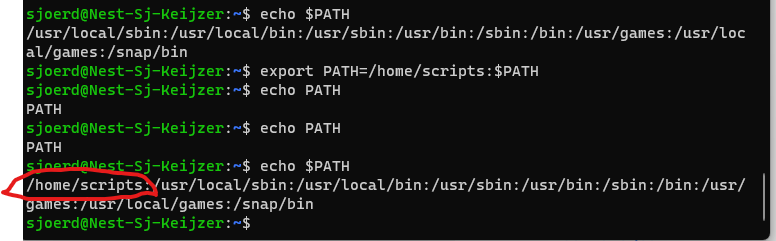
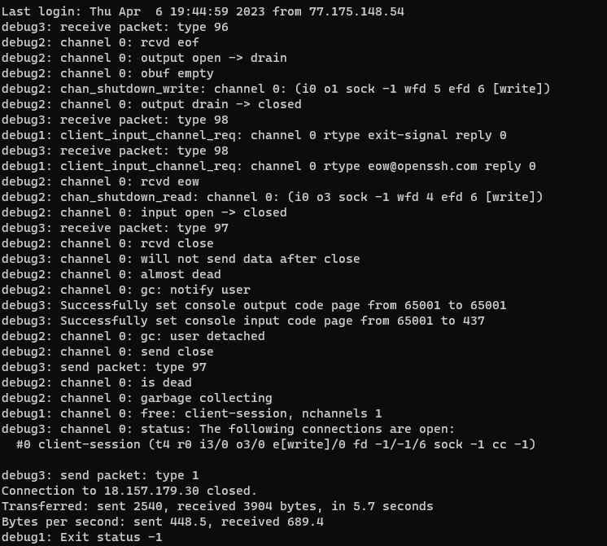

# LNX-07 Bash scripting
[Geef een korte beschrijving van het onderwerp]

## Key-terms

### PATH

### Scripts
Exec explainer.cfg. Ja ja, hadden we dat bijna geautomatiseerd. Scripts zijn stukjes code die van buitenaf een *start* sein krijgen om hun code te runnen. Ook dat startsein kan worden geautomatiseerd.  

### Bash
Jason had ook nog een broertje die computer nerd was. Bash staat voor *B*ourne-*a*gain *sh*ell. Bash scripting is een manier om te automatiseren met scripts.

### shell
Letterlijk een schil, vaak een soort user interface. Kan een text based interface zijn, maar ook een command-line interface (CLI). Het heet vooral een shell omdat het als een schil over de kernel ligt. Dat betekent dat het niet alleen van toepassing is op de CLI maar ook op een (eventuele) graphical user interface (GUI). 

## Opdracht 1
- Create a directory called ‘scripts’. Place all the scripts you make in this directory.
- Add the scripts directory to the PATH variable.
- Create a script that appends a line of text to a text file whenever it is executed.
- Create a script that installs the httpd package, activates httpd, and enables httpd. Finally, your script should print the status of httpd in the terminal.

Ik heb vorige keer zo erg met permissions lopen rotzooien dat ik kennelijk mezelf uit /home had gelocked. Ik kon namelijk eerst geen mkdir scripts doen, wat toch wat onhandig is. 

Volgende is om de scripts map aan PATH variable toe te voegen. 

Het is duidelijk dat de vermoeidheid toe begint te slaan, maar het is gelukt. 

Met `export PATH=/home/scripts:$PATH` zorg ik dat mijn /home/scripts folder nu vooraan komt te staan als ik dit met `echo $PATH` check. 

Verder had ik nog nooit een script gemaakt dus nu werd het echt interessant. 

## Opdracht 2
- Create a script that generates a random number between 1 and 10, stores it in a variable, and then appends the number to a text file.

#### Conditions:
You can choose to only run parts of your script if a certain condition is met. For example, only read a file if the file exists, or only write to a log if the health check returns an error. This can be done using conditions.

A check for a condition can be done using ‘if’, ‘elif’, and/or ‘else’.

## Opdracht 3
- Create a script that generates a random number between 1 and 10, stores it in a variable, and then appends the number to a text file only if the number is bigger than 5. If the number is 5 or smaller, it should append a line of text to that same text file instead.

### Gebruikte bronnen
- https://opensource.com/resources/what-bash
- https://subscription.packtpub.com/book/cloud-and-networking/9781788995597/1/ch01lvl1sec12/what-is-bash
- https://devhints.io/bash
- https://www.pcwdld.com/bash-cheat-sheet
- https://github.com/RehanSaeed/Bash-Cheat-Sheet
- https://www.digitalocean.com/community/tutorials/how-to-view-and-update-the-linux-path-environment-variable
- https://opensource.com/article/17/6/set-path-linux
- https://linuxhint.com/30_bash_script_examples/
- https://askubuntu.com/questions/715219/ssh-connection-closed-right-after-login-exit-status-1

### Ervaren problemen
Toen ik probeerde mijn $PATH fixed te maken, heb ik iets gedaan wat onhandig was. Ik heb een instructie verkeerd gelezen en toen  

`source ~/.bash_profile` doet in jouw huidige .bash_profile. Nu ik het zo terug lees met een nacht slaap, weet ik niet waarom dit toen zo'n goed idee leek. 

Anyway ik dacht, het is gelukt laten we testen of PATH nu ook /home/scripts/ heeft opgeslagen. Powershell gesloten en opnieuw opgestart. 

Daar begonnen echter de problemen. 

Door mijn bash_profile te slopen op bovenstaande manier, wist de container ook niet zo goed meer wat die moest doen. Als ik met SSH probeerde in te loggen gaf die als error 'Connection to [servername] closed'. Vervolgens heb ik in debug mode `ssh -vvvv sjoerd@18.157.179.30` proberen te vinden wat het was. Vooral de onderste helft van het report maakte dat duidelijk.

Exit status -1 is niet zo goed. Container kaduuk. Casper om hulp gevraagd en die heeft mijn bash_profile gereset. Nu kan ik er weer in. 

Als je dit ooit terug leest Casper, nogmaals mucho gracias want ik kon mezelf wel voor mijn kop slaan. 

### Resultaat
[Omschrijf hoe je weet dat je opdracht gelukt is (gebruik screenshots waar nodig).]
