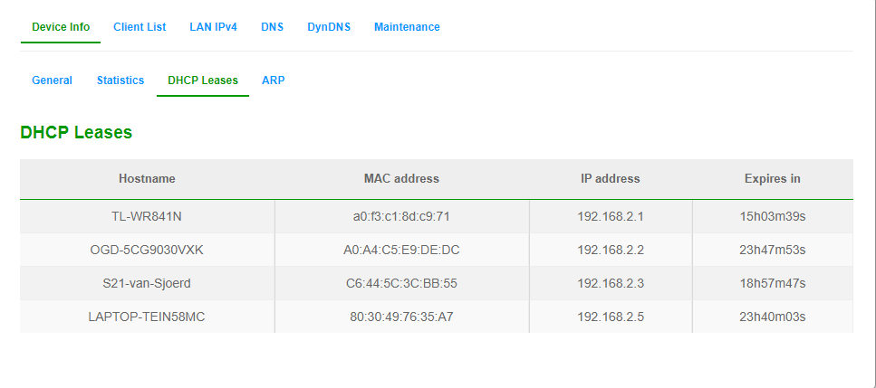
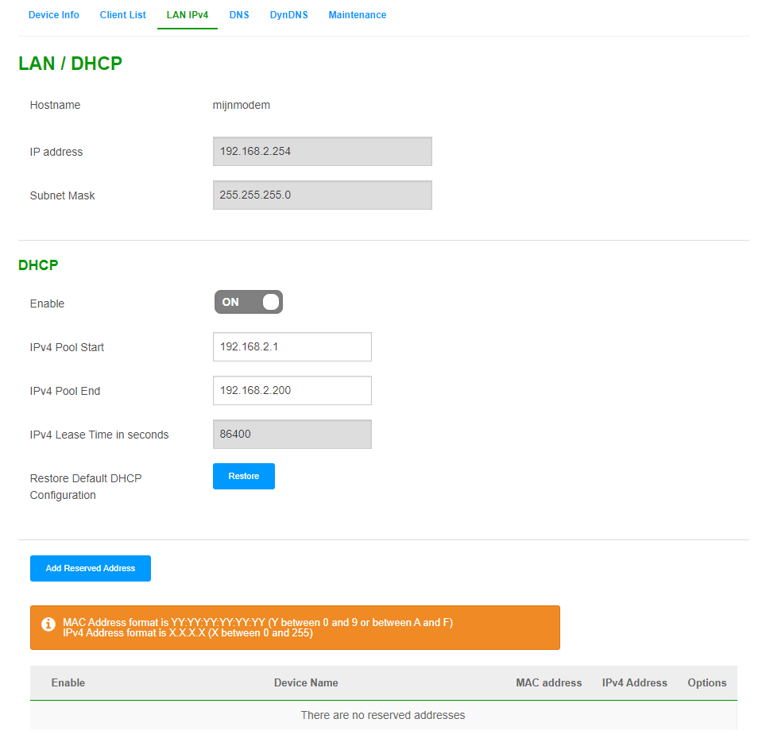

# Network devices
Je kan een hele hoop vrienden maken via het internet. Niet in de laatste plaats met alle apparatuur die je daarbij helpt.

## Key-terms

### DHCP
Dynamic Host Configuration Protocol - zit vaak al in jouw modem/router. Elke keer dat jij een nieuwe device connect met de modem/router zorgt de DHCP ervoor dat die een IP krijgt. Vaak is de router zelf al iets van 192.xxx.xxx.1 en alles wat daarna aansluit krijgt .2, .3 enzovoort. 

## Opdracht
- Benoem en beschrijf de functies van veel voorkomend netwerkapparatuur
- De meeste routers hebben een overzicht van alle verbonden apparaten, vind deze lijst. 
- Welke andere informatie heeft de router over aangesloten apparatuur?
- Waar staat je DHCP server op jouw netwerk? Wat zijn de configuraties hiervan?

### Gebruikte bronnen
- https://en.wikiversity.org/wiki/Network%2B/Standards/OSI_Model/OSI_Components
- https://www.geeksforgeeks.org/devices-used-in-each-layer-of-tcp-ip-model/
- https://en.wikipedia.org/wiki/Gateway_(telecommunications)
- KPN Modem

### Ervaren problemen
Enige 'probleem' was dat ik de login gegevens van mijn modem/router/dhcp-blik-in-een van KPN niet meteen kon vinden. Bleek de standaard admin password niet te werken. Uiteindelijk factory reset uitgevoerd en toen deed die het wel. Denk dat KPN was vergeten om dat te reseten. 

## Resultaat

Het allerhandigste is als we meteen een mooi tabelletje maken van randapparatuur die bij netwerken vaak voorkomen en op welke layer ze precies werken. 

| Netwerk apparaat |         Layer | 
|---------------- | -------------- |
|                 |                |
| Gateway, Firewall                | Layer 4 - Transport               |
| Router                 |  Layer 3 - Network | 
| Bridge, Switch                  |       Layer 2 - Data Link         |
| Hub, Repeater, Modem, Kabel         |  Layer 1 - Physical |

Bij de application layer (7) en de twee die er bij OSI onderhangen (Presentation en Session) zijn er niet echt apparaten die iets toevoegen; de data/bericht zijn tenslotte al op plek van bestemming aangekomen. Het echt presentabel maken van die data gebeurd in layers 5-7 (of alleen 7 bij TCP stack)

### Benoem en beschrijf de functies van veel voorkomend netwerkapparatuur
- Layer 1 - Physical;
    - **HUB, repeater**: herhalen het signaal wat ze krijgen en sturen het (blind) door. Ze checken niet of het eventueel aankomt. Dat is eigenlijk ook de grootste reden dat deze boys vrijwel nergens meer te bekennen zijn in de huidige infrastructuur. 
    - **Kabel**: hoewel niet echt apparatuur vind ik wel dat deze onbezongen hero hier thuis hoort. Transporteert het signaal (de electroden)
    - **(Klassiek) modem**: zet kabel signaal om in data die Layer 2 apparaat (en hoger) kunnen uitlezen. 
    - **(Wireless) Access Point**: Als we puur kijken naar het component Acces Point dan is een Wireless Access Point vooral een wireless hub, omdat een WAP op dezelfde manier functioneert. Net als een HUB is een WAP dan vooral een layer 1 device. *(wel side note, WAP doet natuurlijk ook layer 2 dingen, maar is voooooral een layer 1 device vanwege de primaire functie)*

- Layer 2 - Data link;
    - **Switch**: Ontvangt data en leest MAC adres. Omdat switch alleen MAC snapt, zal deze in zijn CAM table, MAC adressen opzoeken. Als het in zijn adresboekje staat, stuurt de switch het weer verder.

- Layer 3 - Network
    - **Router**: tegenwoordig is de modem die je van je ISP (Internet Service Provider; de Ziggo's en KPN's van deze wereld) krijgt of in bruikleen hebt, meteen een router, DNS en DHCP server in een. 
    Hoe een klassieke router werkt, is met IP addressen. Praat je IP, dan weet de Router precies waar het naar toe moet.  

Layer 4 - Transport
   - **Gateway** - Verreweg de meeste zitten bijvoorbeeld al verwerkt in de modem/router van jouw ISP en WiFi routers. Laat ik zeggen dat de normale huis/tuin/keuken gebruiker geen losse gateway in zijn/haar lokale netwerk heeft zitten. 

   Anyway, een **gateway** zorgt ervoor dat losse netwerken met elkaar kunnen communiceren. 60 jaar terug kon een IBM netwerk niet met een Microsoft netwerk communiceren. Een gateway is een van de dingen die dat makkelijker heeft gemaakt.  

   Als we het voorbeeld van een WiFi router nemen dan is dat zowel een router (delivering data) en een gateway (vertaalt de protocollen/data zodat de devices naar waar het toe moet het kunnen gebruiken). 

Nog terugkomen op de rest van de opdracht:
## De meeste routers hebben een overzicht van alle verbonden apparaten, vind deze lijst. 

## Welke andere informatie heeft de router over aangesloten apparatuur? 

ARP table. Hier zie je bv dat mijn laptop met IP 192.165.2.5 van WiFi2.4 gebruik maakt ipv 5 wat de snelste is. 

Wat ook nog een optie is als je op de device zelf klikt, om deze een andere naam te geven of, mocht dat handig zijn, om deze een static IP te geven. 

## Waar staat je DHCP server op jouw netwerk? Wat zijn de configuraties hiervan?

Ik kan 'em aan/uit zetten en zien dat ik zo'n 199 devices nog kan plaatsen voordat dit een probleem wordt. (de IPv4 Pool start/end geeft de range aan IP's die nog mogelijk zijn).

Daaronder is nog een optie om (static) IP address te reserveren. 

