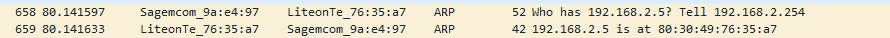

# NTW-03 - Protocollen en wireshark
[Geef een korte beschrijving van het onderwerp]

## Key-terms
[Schrijf hier een lijst met belangrijke termen met eventueel een korte uitleg.]

## Opdracht
- Identify several other protocols and their associated OSI layer. Name at least one for each layer.
- Figure out who determines what protocols we use and what is needed to introduce your own protocol.
- Look into wireshark and install this program. Try and capture a bit of your own network data. Search for a protocol you know and try to understand how it functions.

### Gebruikte bronnen
[Plaats hier de bronnen die je hebt gebruikt.]

### Ervaren problemen
[Geef een korte beschrijving van de problemen waar je tegenaan bent gelopen met je gevonden oplossing.]

### Resultaat

Wat dingen die mij opvielen toen ik wat met Wireshark aan het spelen was:

Dit is mijn modem van kpn (Sagecom) die aan LiteonTE vraagt: hallo? Wie heeft 192.168.2.5? (Mijn laptop die kennelijk onderdelen heeft van Lite-on). Mijn laptop zegt hallo terug en zegt ook wat zijn MAC adres is. Stuur dit terug naar 192.168.2.254. En dat is dan weer het IP adres waar mijn gateway/DHCP server staat geconfigureerd.  

Het gaat om een 'simpele' ARP request, maar ik vond het toch grappig. 
