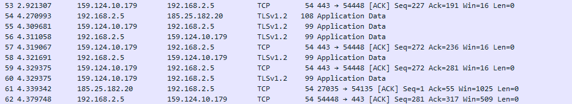
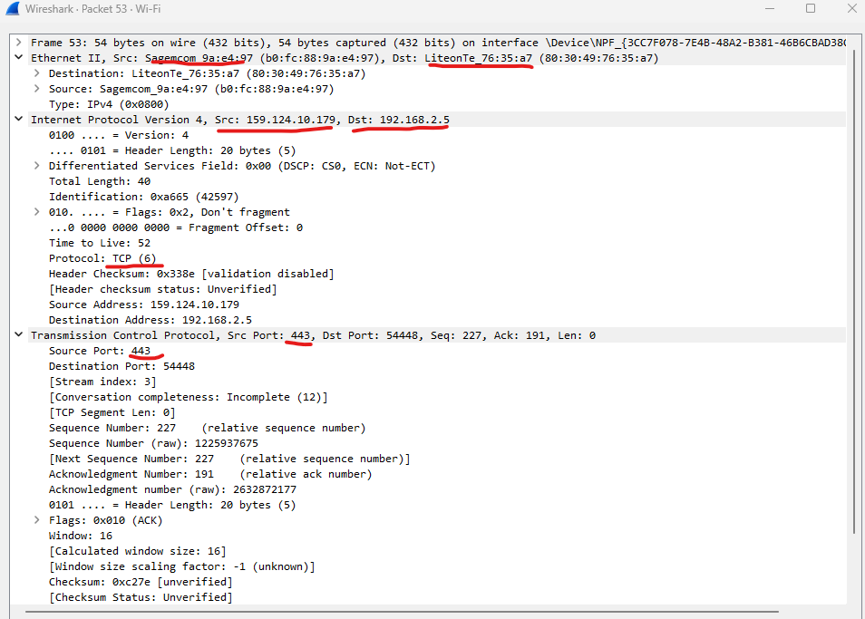

# Protocollen en wireshark
Wie beslist nou eigenlijk welke protocollen we gebruiken op het internet?

## Key-terms
- **Protocol**:
Afgesproken 

- **HTTP(s)**:

- **TCP**

- **ARP**
Address Resolution Protocol. Probeert MAC adressen te ontdekken in een netwerk via een IP adres. Opereert op layer 2. 

- **UDP**:
Snel.

- **SSH** 

## Opdracht
- Identify several other protocols and their associated OSI layer. Name at least one for each layer.
- Figure out who determines what protocols we use and what is needed to introduce your own protocol.
- Look into wireshark and install this program. Try and capture a bit of your own network data. Search for a protocol you know and try to understand how it functions.

### Gebruikte bronnen
- https://en.wikipedia.org/wiki/List_of_network_protocols_(OSI_model)
- https://www.geeksforgeeks.org/layers-of-osi-model/
- https://www.comptia.org/content/guides/what-is-a-network-protocol
- https://www.internetx.com/en/news-detailview/who-creates-the-standards-and-protocols-for-the-internet/#:~:text=Internet%20Architecture%20Board%20(IAB)
- https://www.internetsociety.org/internet/who-makes-it-work/
- https://en.wikipedia.org/wiki/Internet_Standard
- https://osqa-ask.wireshark.org/questions/11863/why-do-tcp-clients-send-packets-with-no-data/
- https://www.whois.com/whois/

### Ervaren problemen
Er zijn zo ontzettend veel protocollen dat je moet oppassen dat je ze niet per 100 over je scherm ziet vliegen en een rabbit hole te duiken. Hetzelfde had ik een beetje met Wireshark omdat je er wel heel veel mee kan. Toch maar een screenshot genomen en dat resultaat verder uitgetypt, ik had hier nog uren op kunnen blijven hangen. 

## Resultaat

### - Identify several other protocols and their associated OSI layer. Name at least one for each layer.

| Layer    |	Name |	Function |	Protocols |
|-------------- |--------- | ------------------ | ------- |
| Layer 7 |	Application |	To allow access to network resources. |	SMTP, HTTP, FTP, POP3, SNMP |
| Layer 6 |	Presentation |	To translate, encrypt and compress data. |	MPEG, ASCH, SSL, TLS |
| Layer 5	| Session |	To establish, manage, and terminate the session |	NetBIOS, SAP
| Layer 4 |	Transport |	The transport layer builds on the network layer to provide data transport from a process on a source machine to a process on a destination machine. |	TCP, UDP |
| Layer 3 |	Network |	To provide internetworking. To move packets from source to destination |	IPV5, IPV6, ICMP, IPSEC, ARP, MPLS. |
| Layer 2 |	Data Link |	To organize bits into frames. To provide hop-to-hop delivery |	RAPA, PPP, Frame Relay, ARP, ATM, Fiber Cable, etc. |
| Layer 1 |	Physical |	To transmit bits over a medium. To provide mechanical and electrical specifications |	RS232, 100BaseTX, ISDN, 11.

****

 ### a) Figure out who determines what protocols we use and b) what is needed to introduce your own protocol.

Om maar in huis te vallen met antwoord a) van hier boven. Er zijn verschillende groepen die zich bezig houden met het maken en beheren van protocollen. Soms is dat dezelfde groep, maar soms is er voor de beheer taak een aparte organisatie. Dit is niet eens een uitputtende lijst:

 Naam instituut (afkorting) (zou je kunnen kennen van:)
- The Institute of Electrical and Electronis Engineers (IEEE)
- The Internet Engineering Task Force (IETF)
- The International Organisation for Standardization (ISO)
- The International Telecommunications Union (ITU-T) (Public Key Infrasstructure (PKI))
- The World Wide Web Consortium (W3C) (HTML, CSS, XML)
- The Internet Architecture Board (IAB) (DNS root systeem) 
- Internet Consortium for Assigned Names and Numbers (ICANN) (beheert DNS hierarchie en de allocatie van IP adressen aan domeinen).

Dan nog het b) gedeelte. 
Je kan een zogenoemd Request For Comments (RFC) indienen bij bijvoorbeeld de IETF, als jij een netwerk protocol hebt geschreven. In principe kan iedereen een nieuw protocol schrijven. De RFC is een document dat uitlegt hoe het protocol werkt en wat de (technische) vereisten zijn om het te draaien. De IETF zal het toetsen en als je geluk hebt (of je bent brilliant, natuurlijk komt het er dan doorheen), dan wordt het door de IETF als *'Proposed Standard'* aangenomen. 

Het kan later nog tot *'Internet Standard'* worden gepromoveerd, maar praktijk wijst uit dat de meeste nieuwe aangenomen protocollen van de laatste jaren, op *'Proposed Standard'* blijven hangen. 

### Look into wireshark and install this program. Try and capture a bit of your own network data. Search for a protocol you know and try to understand how it functions.

Wat dingen die mij opvielen toen ik wat met Wireshark aan het spelen was:

Dit is mijn modem van kpn (Sagecom) die aan LiteonTE vraagt: hallo? Wie heeft 192.168.2.5? (Mijn laptop die kennelijk onderdelen heeft van Lite-on). Mijn laptop zegt hallo terug en zegt ook wat zijn MAC adres is. Stuur dit terug naar 192.168.2.254. En dat is dan weer het IP adres waar mijn gateway/DHCP server staat geconfigureerd.  

Het gaat om een 'simpele' ARP request, maar ik vond het toch grappig. 

Iets anders wat meer met de echte opdracht van doen heeft: 

Hier zie je een hele rij dingen gebeuren met TCP en TLS protocol. 

185.25.182.20 is bijvoorbeeld een IP adress van Valve Corporation. Ik heb Steam op mijn laptop staan, en er gaan kennelijk nog wat (lege) packets daar naar toe in de achtergrond om de Steam applicatie bij te werken/te zeggen dat de connectie nog steeds in orde is.

159.124.10.179 is Zoom! Dat is vrij logisch dat die dingen aan het doen is, die staat nu namelijk open met Breakout Room 2. 

De ACK die je ziet staan hoort bij de tree-way handshake die TCP doet en ACK staat voor ACKnowledged. 

*note: IP's heb ik opgezocht met een whois IP website omdat het niet direct in Powershell kan.* 

Als we nog wat dieper bij Zoom kijken wat er gebeurd, zien we dat het signaal in eerste instantie bij mijn Modem (Sagecom) vandaan komt, destination is LiteonTE, op dat niveau de naam van mijn laptop. Ze kennen elkaar op die layer alleen met MAC adres. 

Als we naar IP protocol gaan staat daar het stukje met de IP's. Zender IP = zoom, destination IP = mijn laptop. Gekozen protcol is in dit geval TCP. 

Wat verder opvalt is dat de source port 443 is, en dat is de standaard port die wordt gebruikt voor een HTTPS verbinding. Daarnaast zie je de Seq (sequence), Ack (Acknowledged) en Len (Length). 

Toevallig heb ik dan misschien net het verkeerde voorbeeld gepakt met 0 length packet. Dat is wat minder spannend dan dat je echte data hebt die wordt verstuurd. Maar die zero packets worden ook nog gestuurd om bijvoorbeeld te zeggen dat de connectie/receptie nog steeds in orde is. 