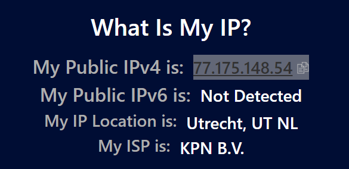
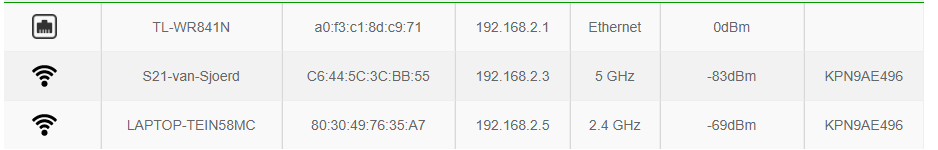

# NTW-05 IP adressen
Wat is een IP, wat doet het en waarom is het handig? Dat gaan we uittesten in deze opdracht. 

## Key-terms
### **IP adressen**
In essentie is een IP adres een lijntje nummers die een apparaat wat aan een netwerk hangt met het IP protocol, krijgt toegewezen. Zo krijgt het apparaat een 'naam' zodat netwerk apparatuur weet wat die met bepaalde vragen 

### **IPv4**:
Iedereen heeft een IPv4 adres en die zijn, soort van, allemaal op. Hoe kan dat? Omdat IPv4 gebruik maakt van 4 delen zoals 192.168.0.1 of 45.48.241.198. De mogelijke combinaties zijn inmiddels uitgeput want het aantal devices zijn gigantisch toegenomen. Niet alleen computers, maar ook tablets, laptops en telefoons strijden allemaal om een IP adres. Nu zijn er wel oplossingen voor gevonden, maar ondertussen werd er hard gewerkt aan v6 om het doemscenario van 'alles is vol' te voorkomen. 

### **IPv6**:
Als alternatief voor IPv4 is er IPv6. v6 vervangt langzaam maar zeker v4. Het adres van een IPv6 ziet er ongeveer uit als: `2620:cc:8000:1c82:544c:cc2e:f2fa:5a9b`. 
Het lijkt bijna op een MAC adres, maar de oplettende kijker ziet dat dit geschreven is in een hexadecimale notitie. De te maken combinaties daarmee zijn er.. heel, heel, heeeeeeel veel. Volgens mijn bron is het een getal van zo'n 39 getallen lang, en ik kan voor geen meter rekenen dus ik hou het bij: het is veel. 

### **Public en Private IP's**:
Dit gaan we doen aan de hand van een voorbeeld.

Jouw modem/router van jouw ISP is een soort poort/toegangsweg. Van het perspectief van de buitenwereld, komt al het verkeer van jouw lokale netwerk (dus alle devices die daar aan hangen) van de router's **public** IP address. 

In het lokale netwerk, heeft elk device, waaronder de router een eigen lokale **private** IP address, die door de DHCP wordt uitgedeeld. Hoe de router dat precies doet leggen we in de volgende key-term uit.

### **NAT**:
Network Address Translation (NAT). De router ontvangt dus al het verkeer op zijn public IP. Hij moet echter wel de vertaal slag maken naar het lokale netwerk, want bepaalde berichten (eigenlijk allemaal) zijn niet specifiek voor de router maar voor een device verder op in het netwerk. De router verandert het bron en eindbestemming IP in de packet headers wanneer een bericht/data van public > private netwerk wordt verscheept (en andersom). 

### **Statische en dynamische adressen**:
Een statische IP is een IP adres wat nooit veranderd en daarmee altijd constant is. Dit kan handig zijn als er een device of service is die makkelijk op het internet te vinden moet zijn, bijvoorbeeld web (host) servers of gaming servers. Je kan bij je ISP ook een static IP reserveren, doorgaans zal je daar wel extra voor moeten betalen. 

Dynamisch IP is een IP wat kan veranderen. Het is dus niet vast. Vooral in een thuis situatie is dit het geval en zal de DHCP server op jouw modem/router een IP toewijzen die beschikbaar is uit een bepaalde range. De ene keer kan mijn laptop 192.168.2.5 zijn, de andere keer 192.168.2.4. 

## Opdracht
- Ontdek wat je publieke IP adres is van je laptop en mobiel op wifi.
- Zijn de adressen hetzelfde of niet? Leg uit waarom.
- Ontdek wat je privé IP adres is van je laptop en mobiel op wifi.
- Zijn de adressen hetzelfde of niet? Leg uit waarom.
- Verander het privé IP adres van je mobiel naar dat van je laptop. Wat gebeurt er dan?
- Probeer het privé IP adres van je mobiel te veranderen naar een adres buiten je netwerk. Wat gebeurt er dan?

## Gebruikte bronnen
- https://www.networkworld.com/article/3588315/what-is-an-ip-address-and-what-is-your-ip-address.html
- https://en.wikipedia.org/wiki/IP_address
- https://www.whatismyip.com/

## Ervaren problemen
Ik vind het fijn om bij een opdracht een keer te kunnen schrijven dat dit eigenlijk heel soepel verliep. 

## Resultaat
### Ontdek wat je publieke IP adres is van je laptop en mobiel op wifi.

Deze heb ik opgevraagd via een website op mijn laptop. Ik heb ook op mijn mobiel public IP opgevraagd, maar dat blijft het zelfde, de 77.175.148.54. 

### Zijn de adressen hetzelfde of niet? Leg uit waarom.
Ze zijn hetzelfde omdat alle traffic die van buiten komt wordt gefunneld naar de modem/router van KPN en die zet het via NAT protocol om naar private IP's binnen mijn LAN omgeving.

### Ontdek wat je privé IP adres is van je laptop en mobiel op wifi.
Dan gaan we weer inloggen op de modem en nemen we een kijken bij de DHCP client list:

Mijn S21 mobiel die heeft binnen mijn netwerk 192.168.2.3 gekregen en mijn laptop heeft nog steeds 192.168.2.5. 

### Zijn de adressen hetzelfde of niet? Leg uit waarom.
Nee de IP's zijn niet het zelfde, de informatie zou dan niet op de juiste plek komen of de router weet niet naar welke van de 2 IP's de informatie precies moet. 
Ironisch genoeg werken layer 1 apparaten als HUB's en repeaters en in zekere zin WAP's natuurlijk wel zo; die zenden gewoon en hopelijk zit de ontvanger er ook bij. 

Maar om niet te verzanden in potatoe-potato, het is voor een router makkelijker routen (en efficienter) als die meteen weet welke informatie/data naar welk device moet. Daarom is handig als elk device zijn eigen IP heeft. 

### Verander het privé IP adres van je mobiel naar dat van je laptop. Wat gebeurt er dan?

Op mijn telefoon via Instellingen > WiFi > Netwerk naam > advanced mijn IP instellingen naar 'Static' kunnen zetten en IP veranderd naar die van mijn laptop, zie screen: 

Ik heb browser geopened en ben express naar iets gaan zoeken wat niet in mijn cache staat. ik had niet verwacht dat het internet blijft werken op zowel mijn laptop als mobiel, maar het is wel significant trager, zeker bij de eerste zoekopdracht. ADSL inbel momenten ben ik weer aan het herbeleven. Daarna lijkt het wel weer te settelen. 

### Probeer het privé IP adres van je mobiel te veranderen naar een adres buiten je netwerk. Wat gebeurt er dan?

Ik heb ik mijn IP van mijn mobiel veranderd naar 77.168.2.3. Als ik dan een app als bijvoorbeeld de NOS wil openen, dan is die heel lang bezig met laden om vervolgens te zeggen *'geen internet'*. Hetzelfde als ik nu wat random's google als *'wat is de nationale drank van Peru'* dan timed mijn search eigenlijk uit. 

Task failed succesfully!