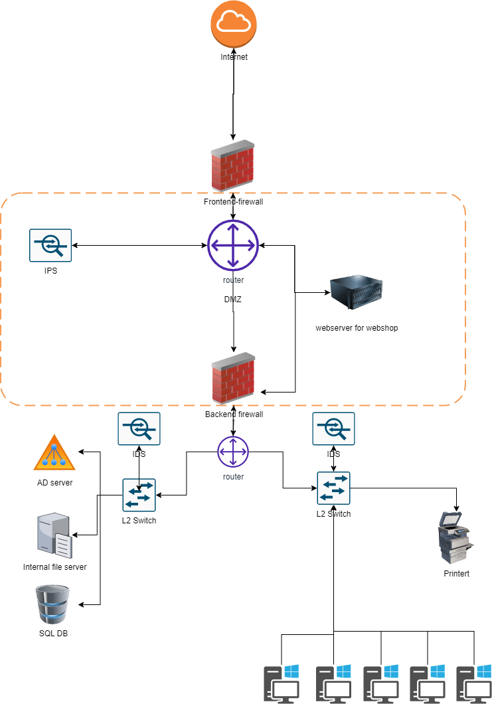

# NTW07-case study
Bouw je eigen webshop toko. Doen we. 

## Key-terms
- DMZ (demilitarized zone). Ik wist oprecht niet dat dit ook in de IT werd gebruikt. Een DMZ in militaire zin is een soort niemandsland, een bufferzone. Grens tussen de twee Korea's in een voorbeeld. In de IT moet je het ook zien als een bufferzone, dit om een veiligheidszone te creeren. 

## Opdracht
The office contains the following devices:
- A web server where our webshop is hosted
- A database with login credentials for users on the webshop
- 5 workstations for the office workers
- A printer
- An AD server
- A file server containing internal documents

As a network administrator you get to choose which networking devices get used.

- Design a network architecture for the above use case.
- Explain your design decisions

### Gebruikte bronnen
- https://www.barracuda.com/support/glossary/dmz-network
- https://intellipaat.com/blog/what-is-dmz-network/

### Ervaren problemen
Het bedenken van een echt kloppende architectuur blijft wel een ding. Ben nu natuurlijk nog low skilled, dus ik merk dat ik heel erg blijf schuiven met routers/firewalls voor een logische en veilige routing van data. Denk wel dat het gewoon een kwestie is van meer doen, en dan kom ik er vanzelf achter na diagram 8 dat het veel makkelijker kan en dat ik nu vet ingewikkeld zit te doen. 

### Resultaat
Ik had meteen al zoiets dat het handig zou zijn om bepaalde zaken te clusteren. Front-end vs back-end en de werkplekken voor medewerkers.

Laten we daarmee beginnen. In ieder geval:

- Frontend: In ieder geval webserver

- Back-end: DB with login credentials (SQL) + Active Directory server + file server for internal documents

- Office LAN: 5 workstations + printer

Nou zou ik in schatten dat met 5 workstations dit geen hele grote webshop is met gigantisch veel traffic. Mocht dat wel zijn, kan je ook nog overwegen om meer dan 1 hostingmachine voor de webshop te maken met een load balancer ervoor in de DMZ. Zou ook nog een middel kunnen zijn tegen Ddos aanvallen, maar dat hopen we te voorkomen door de nodige veiligheidsmaatregelen en firewalls. 

Wat ik wel verwarrend vind, als ik het internet afstruin voor wat inspiratie van netwerk diagrammen, soms de volgorde van router en firewall wordt omgedraait. Bij de ene staat eerst internet > router > firewall en bij anderen internet > firewall > router. Puur op basis van het layer model en waar een firewall voornamelijk op layer 4 werkt, lijkt me het meest logisch dat die laatste de voor de hand liggende volgorde is. 

Toen ik eigenlijk bijna klaar was, bedacht ik me het volgende: bij het Corporate gedeelte heb ik de back-end en office gedeelte ieder een eigen switch gegeven met een corporate router erboven. Dit had ook allemaal in 1 router of L3 switch gekunt. Ik laat de diagram zoals die nu is, dan kan ik verder met de SEC modules. 