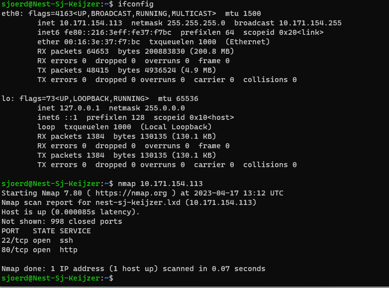
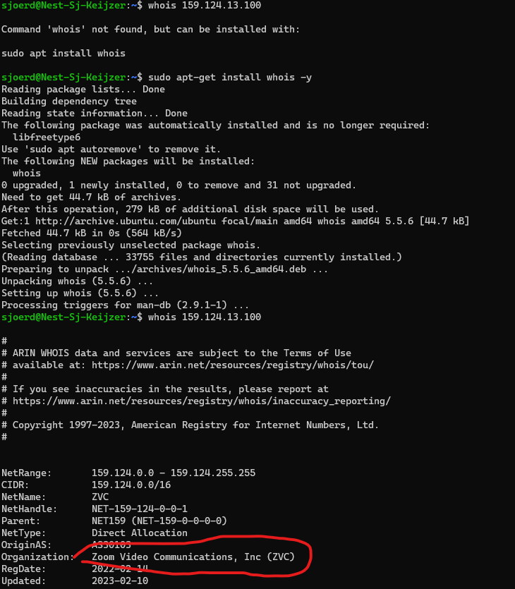
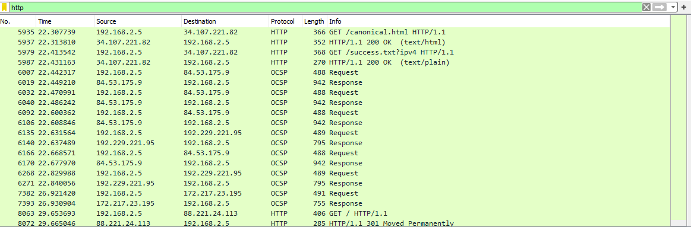

# SEC-01 Netwerk detectie
Attentie attentie, netwerk detectie preventie!

## Key-terms
- Nmap: tool om netwerken te scannen.

## Opdracht
Scan the network of your Linux machine using nmap. What do you find?
Open Wireshark in Windows/MacOS Machine. Analyse what happens when you open an internet browser. (Tip: you will find that Zoom is constantly sending packets over the network. You can either turn off Zoom for a minute, or look for the packets sent by the browser between the packets sent by Zoom.)

### Gebruikte bronnen
- https://www.geeksforgeeks.org/nmap-command-in-linux-with-examples/

### Ervaren problemen
Geen. Ik had al eerder in NTW module Zoom packets gepakt via Wireshark en ik wist uit eerdere opdracht dat je whois command kan doen op Linux. (Als je die wel eerst installeerd :) )

### Resultaat
Eerst moeten we weten wat het IP is van de VM. Daarna kunnen we die nmappen.

We zien dat port 22 open staat voor SSH en we zien dat port 80 open staat voor http protocol. 

Via Wireshark zie ik super veel UDP maar ook TCP verkeer voorbij vliegen van `159.124.13.100`. Vorige keer bij NTW met wireshark had ik al gevonden dat `159.124.x.x` Zoom is. Laten we deze keer met de VM kijken of dat weer zo is. 

Het is inderdaad Zoom. 

Maar dat was niet perse de opdracht, dat was kijk of je tussen door de pakkets van Zoom kan vinden wat er gebeurd als je een browser opstart.

In mijn geval zie ik dat `34.107.221.82` TCP packets stuurt en na een nieuwe whois check, blijkt dat een IP van Google te zijn. Zelfde geldt voor `172.217.23.195`.   

Dat kan kloppen, want Google is mijn standaard homepage. Je ziet dus dat de browser meteen allerlei dingen opvraagt waaronder de homepage/zaken die nodig zijn voor de URL balk en dat die vanuit verschillende destinations ook razendsnel weer worden beantwoord. 