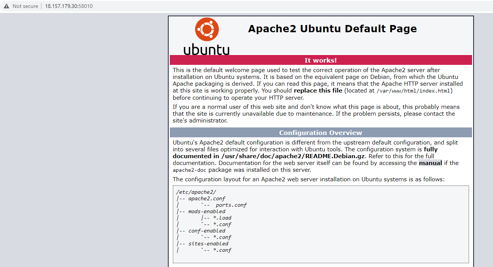
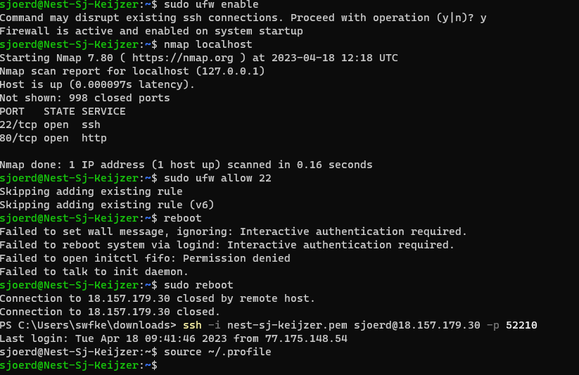

# SEC-02 Firewalls
Zoek je iets om jouw IT veilig te houden van malware en insluipers die er niet horen? Groot hek met vuur doet dat wel goed. 

## Key-terms
### **Firewall algemeen**: 
Een apparaat dat inkomend en uitkomend netwerkverkeer bewaakt en bepaalt welk verkeer wordt toegestaan op basis van een gedefineerde set regels.

### **Stateless / Statefull**:
**Statefull**: 'traditionele' firewall. Bepaalt aan de hand van status, poort en protocol of verkeer door mag. Een statefull analyseert verkeer complete stroom van data. Verkeer dat bijvoorbeeld niet de verplichte handshake kunnen voltooien worden geblockt. Minpunt van statefull is, omdat ze intensief monitoren, dat ze prooi kunnen valleen aan DDoS aanvallen.
**Stateless**: Deze analyseert een deel van packets, niet algeheel verkeer, en kan daardoor geen analyse maken van grotere stromen. Als de deel packet aan de gestelde veiligheidsregels voldoet, mag die door. De hele packet wordt niet gechecked. Om Stateless goed werkend te krijgen heb je dus wel een uitgebreide configuratie nodig. Voordeel is dan wel weer dat Stateless veel verkeer makkelijk aan kan. 

### **Hardware / software**:
Firewall kan zowel op hardware als software niveau zitten. Zoals hardware firewall doet vermoeden, is dit een echt fysiek apparaat. Het vereist wel de nodige ICT kennis om een hardware firewall goed te laten werken, maar als je het goed kan instellen dan is het wel een zeer betrouwbare en veilige manier.

Een software firewall wordt geinstalleerd op een server/computer. Als het een server betreft dan is het een soort paraplu die het netwerk monitort op bedreigingen. Bij veel bedrijven geniet de software firewall de voorkeur omdat die niet duur is, niet heel ingewikkeld in te stellen en weinig kennis vereist.

**NGFW**:
Next Gen Firewall Wall. De Chinese Muur is hier niks bij. 

## Opdracht
- Installeer een webserver op je VM.
- Bekijk de standaardpagina die met de webserver geïnstalleerd is.
- Stel de firewall zo in dat je webverkeer blokkeert, maar wel ssh-verkeer toelaat.
- Controleer of de firewall zijn werk doet.

### Gebruikte bronnen
- https://www.cisco.com/c/nl_nl/products/security/firewalls/what-is-a-firewall.html
- https://www.cdw.com/content/cdw/en/articles/security/stateful-versus-stateless-firewalls.html#:~:text=Stateful%20firewalls%20are%20capable%20of,preset%20rules%20to%20filter%20traffic.
- https://www.n-able.com/blog/stateful-vs-stateless-firewall-differences
- https://www.sangfor.com/blog/cybersecurity/what-software-firewall-difference-between-hardware-firewall-and-software

### Ervaren problemen
Het duurde vrij lang voordat het kwartje viel en ik niet het IP adres van mijn VM moest gebruiken maar IP van de server + poort nummer om daar de standaardbrowser van apache te kunnen zien. 

Eerst ook nog verkeerde poort nummber gebruikt (van SSH key) dus toen kreeg ik ook eerst nog een andere error, namelijk `400 Bad request`. Toen gaan googlen en toen bedacht ik met dat er ook nog een andere port was in het excel document. Voila de webport en die deed het dan ook. 

### Resultaat
Apache al bij Bash Scripting geinstalleerd. 

Toen ik er uiteindelijk op kwam hoe dit te openen was dit deel eenvoudig: `serverIP+webport = apache homepage`

Laten we vervolgens de firewall enablen. Om te zorgen dat ik metzelf niet uit SSH connectie lock, eerst nog `sudo ufw allow 22` en `sudo ufw allow 'OpenSSH'` gedaan zodat ik daar geen problemen mee zou hebben. 

For good measure nog gekeken of daarna de ports open stonden, en dat 22 nog steeds ok was (ja, want skipping existing rule). 

Vervolgens gereboot zodat het ook effect zou hebben. Ik kon gelukkig nog in mijn VM.

Ik zat nog wel even te puzzelen hoe ik alles kon uitzetten zodat ik de default page niet meer kon zien. Alle relevante ports dichtzetten was zo gebeurd, maar bleef connectie houden. Pas toen ik ook `sudo ufw deny 'Apache'` en `sudo ufw deny 'Apache Full'` deed, was de Apache2 Ubuntu default page niet meer bereikbaar. 