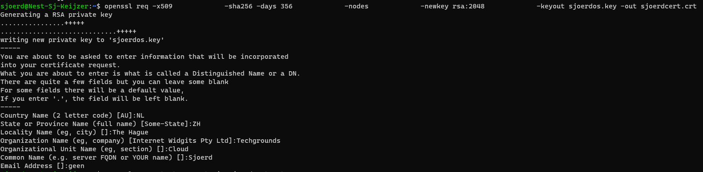
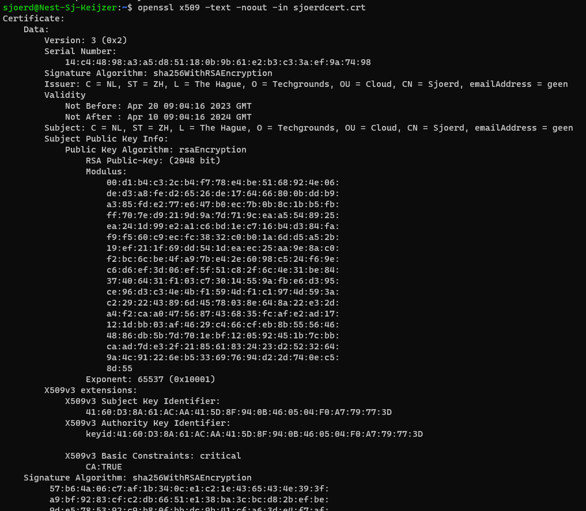
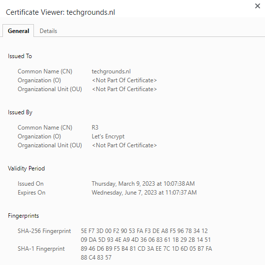
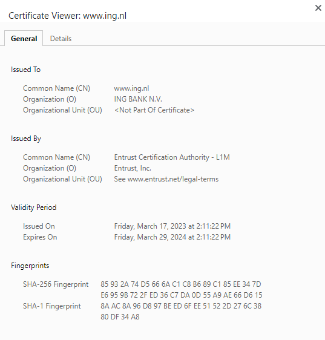
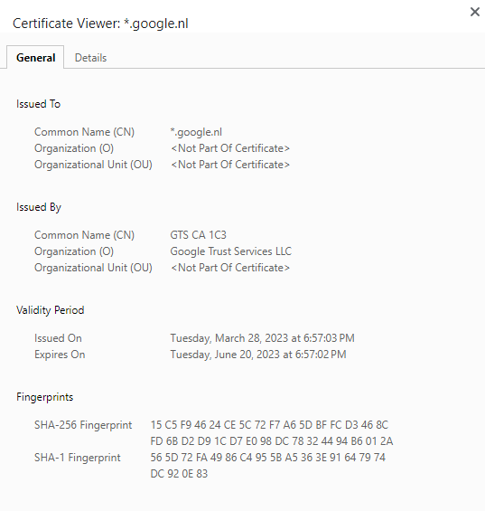
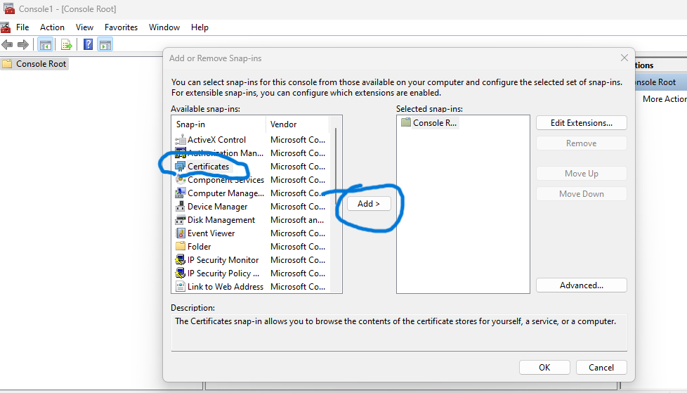
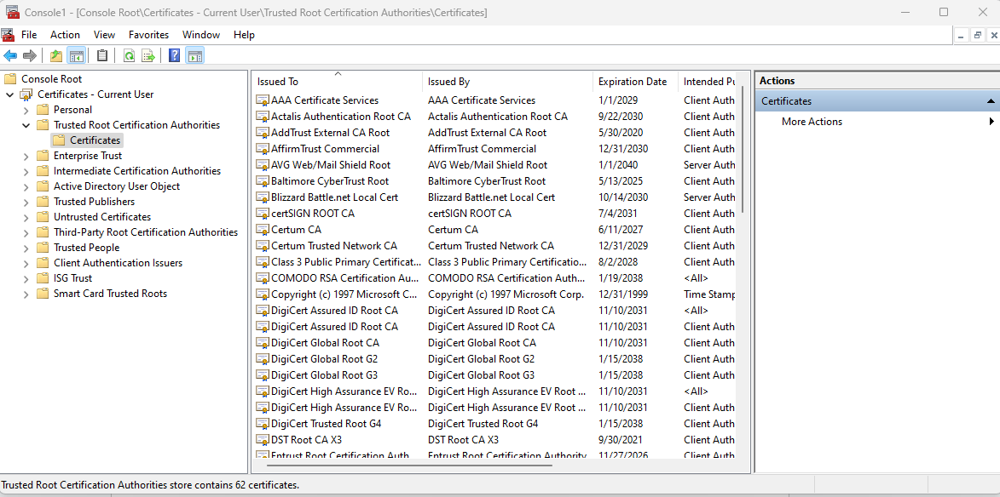
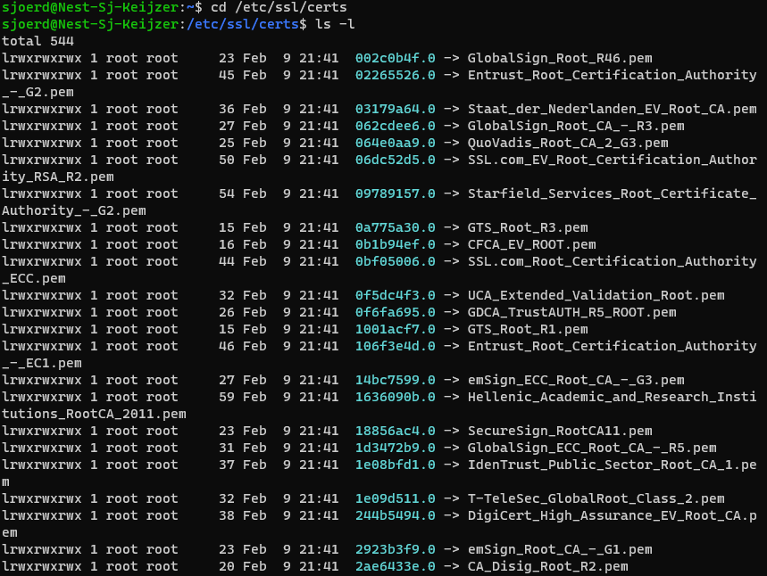

# SEC-06 Public Key Instrastructure and Certificates
[Geef een korte beschrijving van het onderwerp]

## Key-terms
### **PKI**: 
Public Key Infrastructure. PKI gebruikt cryptografische public keys, die gepaired zijn aan een digitaal certificaat, welke het apparaat of gebruiker authenticeert. PKI is de basis waar SSL en TLS gebruik van maken. Over die begrippen hieronder meer. 

### **Digital Certificate**:
Digital certificates zijn uitgegeven door een trusted source, een **certificate authority (CA)** en op die manier zijn ze een soort digitaal paspoort; de zender kan geverifieerd worden. 

### **Registration authority (RA)**:
De RA verifieert de identiteit van de user of apparaat die het digitaal certificaat opvraagt. Dit kan een derde partij zijn, maar ook de CA kan optreden als de RA. 

### **X 509**:
is een standaardformaat voor certificaten met openbare sleutel, digitale documenten die cryptografische sleutelparen veilig koppelen aan identiteiten zoals websites, individuen of organisaties.

Ongeacht de beoogde toepassing(en), elk X.509-certificaat bevat een; publieke sleutel, digitale handtekeningen 
 en informatie over zowel de identiteit die aan het certificaat is gekoppeld even als de afgifte ervan certificeringsinstantie (CA).

De publieke sleutel maakt deel uit van een sleutelpaar dat ook een privé sleutel omvat. De privésleutel wordt veilig bewaard en de openbare sleutel is opgenomen in het certificaat. Dit staat de eigenaar van de privésleutel toe om documenten digitaal te ondertekenen; deze handtekeningen kunnen worden geverifieerd door iedereen met de bijbehorende openbare sleutel.
Hiermee kunnen derden berichten verzenden die zijn versleuteld met de openbare sleutel en die alleen de eigenaar van de persoonlijke sleutel kan ontsleutelen.

Een digitale handtekening is een gecodeerde hash (digest met vaste lengte) van een document dat is gecodeerd met een privésleutel. Wanneer een X.509-certificaat is ondertekend door een publiekelijk vertrouwde CA, zoals SSL.com, kan het certificaat door een derde partij worden gebruikt om de identiteit van de entiteit die het presenteert te verifiëren.

Elk X.509-certificaat bevat velden die de onderwerpen, afgevende CA, en andere vereiste informatie zoals het certificaat versie en  geldigheidsduur. Bovendien bevatten v3-certificaten een set van extensies die eigenschappen definiëren zoals acceptabel sleutelgebruik en aanvullende identiteiten om een ​​sleutelpaar aan te binden.

### **SSL**:
Secure Sockets Layer. Er wordt een beveiligde laag geplaatst tussen een server en een internet browser/andere server waardoor de gegevens beveiligd worden.

SSL certificaten maken gebruik van het https-protocol van de browser (via poort 443) wat de beveiligde verbinding tot stand brengt. Daardoor is (een gedeelte van) de website ook alleen via https:// te bereiken op het internet.

### **TLS**:
Transport Layer Security. Eigenlijk de opvolger en dus de meest recente versie van SSL. 

Wanneer een bezoeker je site bezoekt, zoekt zijn webbrowser naar het SSL/TLS-certificaat van je site. Vervolgens voert de browser een *“handshake”* uit om de geldigheid van je certificaat te controleren en je server te verifiëren. Als het SSL certificaat niet geldig is, bestaat de kans dat je gebruikers de foutmelding *“your connection is not private”* krijgen, waardoor ze je site mogelijk verlaten.

Nadat de browser van een bezoeker de geldigheid van je certificaat heeft vastgesteld en je server heeft geverifieerd, creëert het in wezen een gecodeerde koppeling tussen de browser en de server om gegevens veilig te transporteren.

En dit is ook waar HTTPS ten tonele verschijnt (HTTPS staat voor “HTTP via SSL/TLS”).

### **CSR**:
Certificate Signing Request. Een van de eerste dingen die je doet om jouw eigen SSL/TLS certificate te maken. Gegenereerd op dezelfde server waar je van plan bent om de cert te installeren, bevat de CSR de nodige informatie die de Certificate Authority (CA) zal gebruiken om het certificate te maken. De public key zit in het certificaat inbegrepen en is getekened met de gepaired private key. 

## Opdracht
- Create a self-signed certificate on your VM.
- Analyze some certification paths of known websites (ex. techgrounds.nl / google.com / ing.nl).
- Find the list of trusted certificate roots on your system (bonus points if you also find it in your VM).

### Gebruikte bronnen
- https://en.wikipedia.org/wiki/Public_key_infrastructure
- https://www.okta.com/identity-101/public-key-infrastructure/
- https://www.freecodecamp.org/news/openssl-command-cheatsheet-b441be1e8c4a/#b723
- https://www.ssl.com/nl/veelgestelde-vragen/wat-is-een-x-509-certificaat/
- https://www.domeinwinkel.nl/blog/2016/03/30/wat-is-een-ssl-certificaat/
- https://kinsta.com/nl/kennisbank/tls-vs-ssl/
- https://www.digitalocean.com/community/tutorials/how-to-create-a-self-signed-ssl-certificate-for-apache-in-ubuntu-22-04
- https://devopscube.com/create-self-signed-certificates-openssl/
- https://www.globalsign.com/en/blog/what-is-a-certificate-signing-request-csr
- https://stackoverflow.com/questions/63195304/difference-between-pem-crt-key-files#:~:text=be%20kept%20secret.-,.,decrypt%20data%20sent%20by%20servers.
- https://support.moonpoint.com/os/windows/certificates/trusted_root.php

### Ervaren problemen
Er zijn natuurlijk meerdere wegen naar Rome om een eigen certificaat te maken, ik vond het wel lastig om tussen alle opties iets te kiezen omdat de meeste net weer een beetje anders zijn dan de andere. Ook verschil in wanneer .key of .pem te gebruiken verwarde me wat. 

### Resultaat
- Create a self-signed certificate on your VM.

Om een certificate te maken hebben we iets nodig om ons daarbij te helpen, in dit geval is dat OpenSSL.

`sudo apt install openssl`

Wat nu? 

1. Maak Private Key dmv RSA.

2. Gebruik private key om CSR te maken

3. Onderteken certificaat (self-signed)

4. Check of de inhoud klopt

We kunnen stap 1-3 ook in 1x doen. 

En kijken of de inhoud klopt als we het nakijken:

Ik ben geen expert, maar dit lijkt mij in orde. 

- Analyze some certification paths of known websites (ex. techgrounds.nl / google.com / ing.nl).

Wat valt op aan deze drie? Dat Google zelf haar certificaat heeft uitgegeven dmv dochteronderneming Google Trust Services. 

ING heeft het ondergebracht bij Entrust, wat gezien de naam alleen al, waarschijnlijk een goede keuze is voor een bank. Je wilt tenslotte wel veilig bankzaken kunnen garanderen voor jouw klanten. Het zou zomaar kunnen dat Entrust dit voor meer financiele instellingen doet en niet alleen aan ING. 

Wat bij Techgrounds 'opvalt' is dat Let's Encrypt een open source en non-profit organisatie is die de cert heeft geissued. 

- Find the list of trusted certificate roots on your system (bonus points if you also find it in your VM).

Ik dacht dat dit heel moeilijk zou worden, maar na 1 keer zoeken had ik al een goede website gevonden die dit perfect uitlegde. 

Je maakt gebruikt van MMC oftewel Microsoft Management Console. 

Bij de panel voegen we certificates toe op user account niveau

En dan kunnen we zo ook bij de Trusted Root certs komen

Bonus als we dit lijstje ook in de VM kunnen vinden.

Ik wist van een vorige opdracht in week 1 dat bij /etc/ alle systeemdingetjes stonden, was in de mappen structuur kort zoeken maar het is gewoon te vinden met `/etc/ssl/certs`

Ik had ook nog alle hidden kunnen opvragen met -a, maar dat stond er niet specifiek bij. De locatie is in elk geval gevonden. 