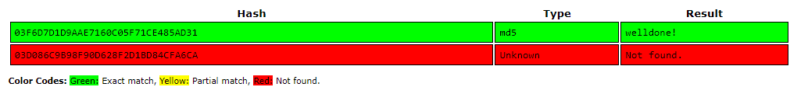
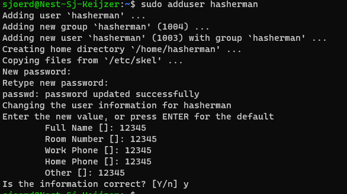
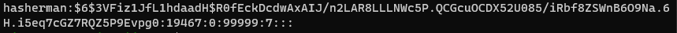

# SEC-07 Passwords
You shall not, pass! (word) 

## Key-terms
### **Hash**: 
In de IT wordt hier niet de harddrug mee bedoelt en staat het voor iets heel anders. 

Er wordt hier een algoritme gebruikt om de invoer (we hebben het in dit geval over wachtwoorden) om te zetten in een vast format welke geencrypt is. Het resultaat is de hash die er ongeveer zo uit zou kunnen zien:
`fc5e038d38a57032085441e7fe7010b0` 

Goed om te weten dat de uitput van de hash altijd 32 tekens is. Maakt niet uit of de input 3 karakters zijn of een heel boek. Maar! Als je binnen dezelfde functie dezelfde input geeft, dan is de output ook altijd hetzelfde (hash).

### **Rainbow table**:
Stel je wilt graag wachtwoorden stelen. Dan kan je dat proberen te doen via een Rainbow table. Als je namelijk de standaard inputs/outputs weet van de Hash dan kan je op die manier dingen identificeren. Een rainbow table is dan eigenlijk niks meer dan een hele grote tabel (ha, table!) met de waardes. Het is wel tijdrovend, dus hoe langer het wachtwoord en ook als je het wachtwoord van een snuifje zout voorziet (salting) dan is de rekenkracht die vereist is voor het kraken door middel van een Rainbow Table, ehm.. heel tijdrovend en bijzonder lastig. 

### **Salting**: 
Nu we het toch over gezouten wachtwoorden hebben, wat is salting precies? Het is een techniek om het kraken van wachtwoorden vele malen lastiger te maken. Er worden namelijk extra gevens toegevoegd die willekeurig zijn, voordat het wachtwoord wordt gehasht. Je voegt dus nog een extra layer van beveiliging toe, en als we iets hebben geleerd van vorige opdrachten, dan betekent meer layers, meer veiligheid. 

Wat salting specifiek met hashing goed maakt, is dat de grote valkuil van hash (zelfde input = zelfde output) teniet doet. Als voorbeeld:

`hash ("hello)                   = a9021932994939e83b2ac5b9e29e1b1c193841`

`hash ("hello + Qxe39dfkdX")     = 8dfac912a93f8as98d8sd09sd9ss3644939e83b`

`hash ("hello + S399d3x94d")     = c9d9d9s7dd38f3364494=3938f33644939d3fg4`

Misschien mis ik een nummer bij het overtypen, maar het is duidelijk dat salting helpt om dezelfde input, te veranderen naar een andere output. Rainbow Table is dan vrijwel nutteloos, of in ieder geval een stuk lastiger toe te passen. 

### **MD5**:
Message Digest Algoritmh 5, is een vorm van een hashing techniek en output is altijd een string van 32 karakters die zowel uit letters als cijfers kan bestaan. 

## Opdracht
- Find out what hashing is and why it is preferred over symmetric encryption for storing passwords.
- Find out how a Rainbow Table can be used to crack hashed passwords.
- Below are two MD5 password hashes. One is a weak password, the other is a string of 16 randomly generated characters. Try to look up both hashes in a Rainbow Table.
03F6D7D1D9AAE7160C05F71CE485AD31
03D086C9B98F90D628F2D1BD84CFA6CA
- Create a new user in Linux with the password 12345. Look up the hash in a Rainbow Table.
- Despite the bad password, and the fact that Linux uses common hashing algorithms, you won’t get a match in the Rainbow Table. This is because the password is salted. To understand how salting works, find a peer who has the same password in /etc/shadow, and compare hashes.

### Gebruikte bronnen
- https://delinea.com/blog/how-do-passwords-work#:~:text=Hashing%20turns%20your%20password%20(or,hash%E2%80%9D%20created%20by%20your%20password.
- https://www.okta.com/blog/2019/03/what-are-salted-passwords-and-password-hashing/
- https://www.techtarget.com/whatis/definition/rainbow-table#:~:text=Rainbow%20tables%20calculate%20the%20hash,next%20to%20their%20corresponding%20hash.

### Ervaren problemen
[Geef een korte beschrijving van de problemen waar je tegenaan bent gelopen met je gevonden oplossing.]

### Resultaat

- Find out what hashing is and why it is preferred over symmetric encryption for storing passwords.

Hash is niet terug te draaien met een sleutel. Precies wat symmetric encryption dus wel is. 

- Find out how a Rainbow Table can be used to crack hashed passwords.

Een manier om hash proberen te kraken. Rainbow table probeert allerlei mogelijke wachtwoorden en de hashes van deze wachtwoorden bij te houden. Het maken van een dergelijke tabel kost weliswaar veel rekentijd en opslagcapaciteit, maar zodra de tabel berekend is, kan een wachtwoord-hash snel omgezet worden in het gebruikte wachtwoord.
Ook op basis van pure rekenkracht; als een wachtwoord kleiner is, dan is deze sowieso al makkelijker te kraken want er zijn simpelweg minder mogelijke combinaties. 

- Below are two MD5 password hashes. One is a weak password, the other is a string of 16 randomly generated characters. Try to look up both hashes in a Rainbow Table.
03F6D7D1D9AAE7160C05F71CE485AD31
03D086C9B98F90D628F2D1BD84CFA6CA

De groene werd dus gekraakt en de ander niet. 

- Create a new user in Linux with the password 12345. Look up the hash in a Rainbow Table

Okidoki, we maken een nieuwe vriend genaamd hasherman met wachtwoord (en alles) als 12345. 

Moet even opzoeken waar we de hash konden vinden, maar uiteindelijk zie je em in /etc/shadow

de `$6$` wil aangeven dat het met HASH 6 methode is gemaakt, wat dan weer overeen komt met SHA512.

Het stukje na de SHA prefix tot en met de volgende $ is het salted gedeelte. 

Ok gaan we deze salted hash proberen te kraken met de Rainbow Table.

Welke combinatie ik ook probeer van wat ik denk dat de 32 character hash is, de Rainbow Table blijft em niet kunnen encrypten. Wat natuurlijk uiteindelijk wel de bedoeling is en laat zien waarom salted hashes dus uitstekend tegen een rainbow table werken. 

- Despite the bad password, and the fact that Linux uses common hashing algorithms, you won’t get a match in the Rainbow Table. This is because the password is salted. To understand how salting works, find a peer who has the same password in /etc/shadow, and compare hashes.

Eigenlijk ook al in de keyterms laten zien bij het voorbeeld, maar ik zie het ook terug bij bijvoorbeeld Kurt, zijn salted hash begint met bijvoorbeeld met

`$6$0jEXuJDuI0O/tiPr$z1oaQoPr`
vs het begin van mijn salted hash:
`$6$3VFiz1JfL1hdaadH$R0fEckDc`

Ondanks dat we dus allebei 12345 hebben gebruikt is de hash compleet anders, doordat het gesalt is. 