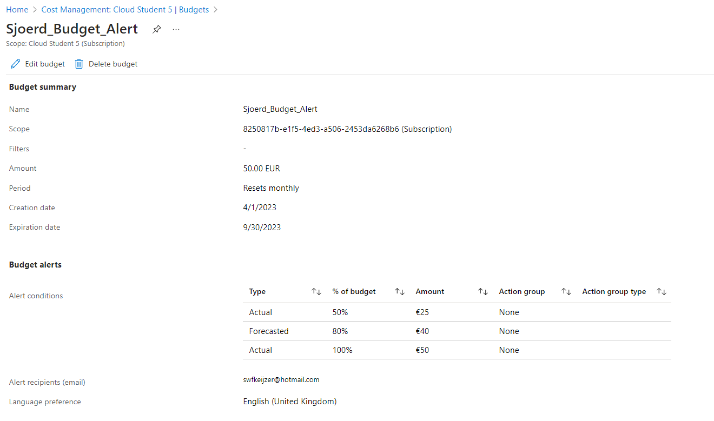

# AZ-02 Cost Management
Werken in de wolkenfabriek is niet gratis. Hou het onder controle. 

## Key-terms
### **Azure principles for cost management**:
- **Plan (Planning)**; 
Een idee wat je wil gaan doen is wel fijn. Dan kan je namelijk ook strategien en rollen maken voor kostenbeheersing. (Finance department will thank you)
- **Zichtbaarheid (Visibility)**:
Hiermee bedoelt Microsoft vooral volledig inzicht in de kosten(structuur) en gebruik van Azure en Azure diensten. Azure Cost Management tab heeft prachtige tools om op van alles en nog wat te filteren en forecast rapports te maken en nog zo 1000 van die dingen. 
- **Verantwoording (Accountability)**: Wees verantwoordelijk: stel duidelijke grenzen voor budget. Zorg voor alert instellingen en maak gebruik van de rapportage en monitoring dashboards om grip te krijgen *en* houden op de kosten. 
- **Optimalisatie (Optimization)**: Heel simpel gezegd: heb je het niet meer nodig? Zet het dan uit, want de kosten lopen wel gewoon door. Capaciteit over in dal-uren? Verzin er iets op dat je iets anders op kan draaien of scale down (aka optimaliseer workloads). 
- **Iteratie (Iteration)**: In dit geval een duur woord voor *'Adapt'*. Blijf verbeteren en wijzig koers wanneer nodig. Dat is makkelijker dan ooit omdat je zo ontzettend veel monitoring mogelijkheden hebt voor zowel Cost Management als Resource Management. 

### **TCO (Total cost of Ownership)**:
Wordt gebruikt om te berekenen hoeveel een infrastructuur kost als het op de traditionele manier gehost wordt. Met de TCO-calculator kan je de kosten van een traditionele infrastructuur vergelijken met de kosten voor dezelfde infrastructuur op Azure.

Ik vind de TCO een machtig mooi ding. De TCO houdt ook rekening met hardware, software en zelfs onderhoud en personeelskosten van traditionele infra. Zo kan een organisatie heel mooi inzien waar de waarde van een Cloud in zit in vergelijking met een traditionele 'on-prem' situatie. En in het geval van Cost Management waar we het hier over hebben, ook over geld besparing en kostenbeheer.

## Opdracht
Bestudeer:
- De Azure principes voor kostenmanagement
- De voorwaarden van de ‘Free subscription’
- Het verschil tussen CAPEX en OPEX.
- De TCO-calculator

Doen:
- Maak een alert aan waarmee je eigen kosten kan monitoren.
- Begrijp de opties die Azure aanbiedt om je uitgaven in te zien.

### Gebruikte bronnen
- https://learn.microsoft.com/en-us/azure/cost-management-billing/
- https://azure.microsoft.com/en-in/pricing/tco/calculator/

### Ervaren problemen
Zelfde als eerst, dankzij John Savill wist ik al de basics van AZ Cost Management. Geen echte ervaren problemen hier. 

### Resultaat
- Maak een alert aan waarmee je eigen kosten kan monitoren.

Toen ik in Azure Portal voor het eerst inlogde zag ik al iets staat van Cost Management. Je raad het nooit, maar daar kan je dus budget en budget alerts in stellen. De uiteindelijke filters en details die je kan invullen zijn bijna eindeloos. Het kan ook simpel: 

- Begrijp de opties die Azure aanbiedt om je uitgaven in te zien.

Wij hebben een vrij klein en overzichtelijke scope van wat we doen en dus wat onze kosten zijn. Voor een groot multinational bedrijf ligt dat anders. Je kan aparte Billing Profiles maken met andere specificaties om zo de kosten structuur meer gescheiden (en overzichtelijker) te houden. 

Je kan ook op Resources en Resource Groups filteren/sorteren. Kortom: Finance afdeling kan heel veel inzien en filteren *als* ze weten hoe het moet. 