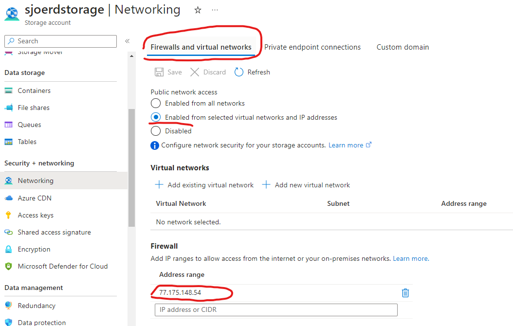
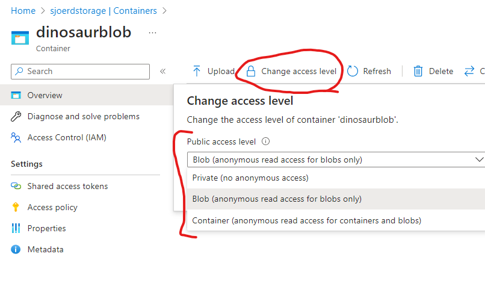
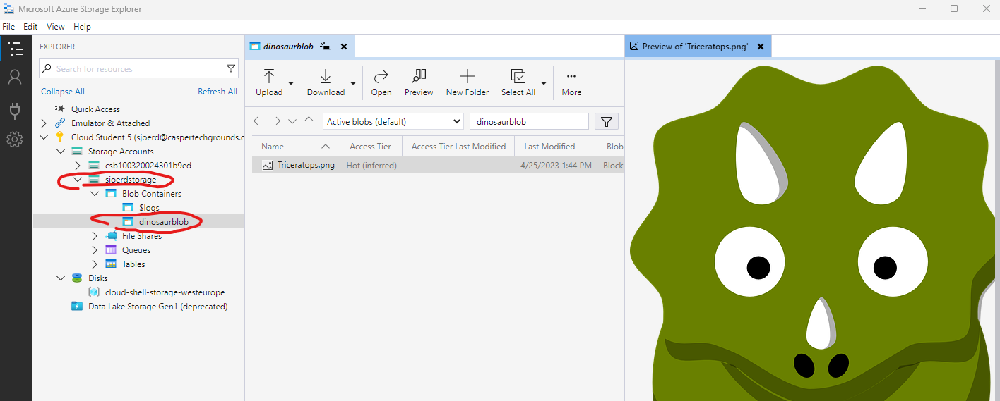
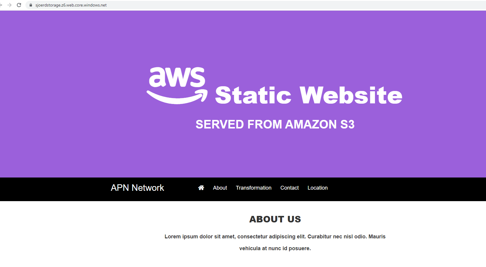

# AZ-05 Storage Account
Blobber blobber de blob. 

## Key-terms
- ### **Storage Account**:
Azure specifiek; je kan hier dus een account maken waar je containers en andere storage methodes onder hangt. Je kan meerdere accounts maken voor verschillende doeleinden en verschillende configs meegeven.

- ### **Blob**: 
Staat voor **B**inairy **L**arge **Ob**ject. Blob Storage is geoptimaliseerd voor het opslaan van grote hoeveelheden ongestructureerde gegevens. Ongestructureerde gegevens zijn gegevens die niet voldoen aan een bepaald gegevensmodel of bepaalde definitie, zoals tekst of binaire gegevens. Alles wordt als een object behandeld. 

## Opdracht
### Opdracht 1:
- Maak een Azure Storage Account. Zorg dat alleen jij toegang hebt tot de data.
- Plaats data in een storage service naar keuze via de console (bijvoorbeeld een kattenfoto in Blob storage).
- Haal de data op naar je eigen computer door middel van de Azure Storage Explorer.

### Opdracht 2:
- Maak een nieuwe container aan.
- Upload de 4 bestanden die samen de AWS Demo Website vormen.
- Zorg dat Static Website Hosting aan staat.
- Deel de URL met een teamgenoot. Zorg ervoor dat zij de website kunnen zien.

### Gebruikte bronnen
- https://learn.microsoft.com/nl-nl/azure/storage/blobs/storage-blobs-introduction
- https://learn.microsoft.com/en-us/azure/storage/blobs/storage-blob-static-website

### Ervaren problemen
Storage account aanmaken was zo gedaan. Blob maken ook. Op een of andere meneer wilde Azure Store Explorer niet standaard openen via de Portal en ik elke keer als ik het wilde downloaden werd ik naar een nieuwe tab gestuurd. Ik dacht dat ik eerst weer moest inloggen zodat Azure weet dat ik een sub heb, maar dat bracht me elke keer weer simpelweg op de landingspage van de portal. Uiteindelijk bij poging 8 simpelweg op OS: windows geklikt en dat was de truc..toen kreeg ik een startende download voor StorageExlporer.exe. hehe. 

### Resultaat
### Opdracht 1:
- Maak een Azure Storage Account. Zorg dat alleen jij toegang hebt tot de data.

Ik heb lang gezocht naar welke stappen precies te doen om alleen mezelf toegang te geven. Volgens mij is de truc om dat te doen bij Public Netwerk access. En dan mijn eigen public IP toe te voegen, zodat alleen ik geauthoriseerd ben op dat IP. 

- Plaats data in een storage service naar keuze via de console (bijvoorbeeld een kattenfoto in Blob storage).

Blob aangemaakt. Nog beetje gespeeld met permissions om te kijken of mijn blob zichtbaar was voor mijn peers. Dat was die, maar moest wel alle connecties open zetten in zowel acces level van de blob en van de sjoerdstorage storage account. 

Kattenfoto's zijn wel heel mainstream dus ik doe lekker eigenwijs en upload een cartoon Triceratops. 

- Haal de data op naar je eigen computer door middel van de Azure Storage Explorer.

___

---

### Opdracht 2

Maak een nieuwe container aan.
- Upload de 4 bestanden die samen de AWS Demo Website vormen.
- Zorg dat Static Website Hosting aan staat.
- Deel de URL met een teamgenoot. Zorg ervoor dat zij de website kunnen zien.

Dit was leuk. Ik was Static Hosting al eerder tegen gekomen bij het onderzoeken van het Azure control panel. Static hosting aangezet. Ik had een nieuwe container aangemaakt, bestanden erin gezet en toen URL voor mezelf geopened om te kijken of dat lukte. Nope. 

Dan maar eerst snel bij de learn microsoft omgeving spieken wat ik verkeerd deed. De container moet wel $web heten anders snapt Azure het niet. Die bleek nu al automatisch aangemaakt te zijn. Ik mijn oude container deleten en de 4 bestanden nu oploaden in $web. Refresh de website in de browser en voila. 

Voor mezelf werkte die toen. Moet natuurlijk bij Acces Level weer aanpassen of die volledige private is of niet. Daarna konden mijn peers ook de website zien. 
