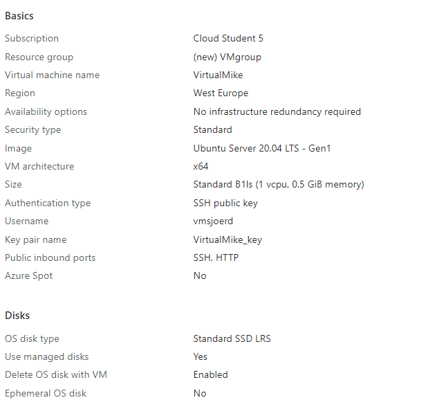
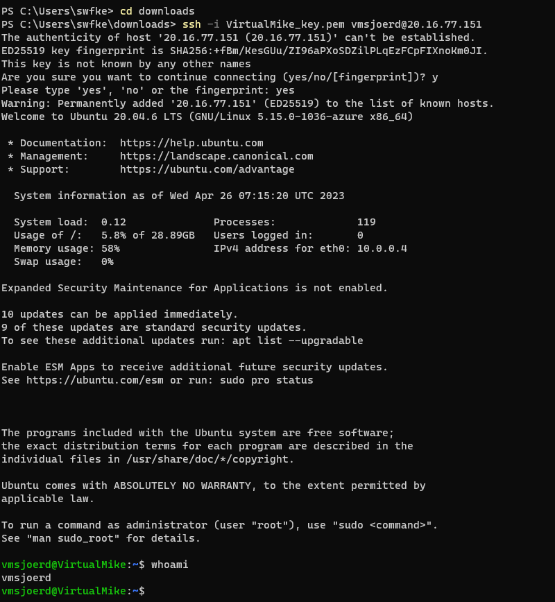
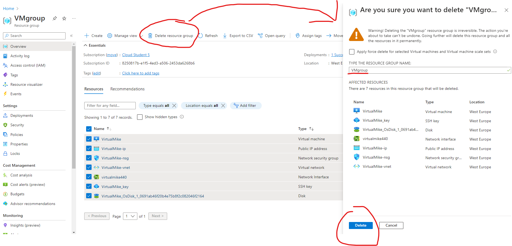

# AZ-06 Virtual Machines
Je kan computers dus wijsmaken dat ze uit meerdere (verzonnen) computers bestaan. Heel handig! 

## Key-terms
Virtual Machine (VM): Een computer die denkt dat die een computer is op een (digitale) harde schijf ergens in een datacenter van Microsoft. 
 

## Opdracht
Maak een VM met de volgende vereisten:
- Ubuntu Server 20.04 LTS - Gen1
- Size: Standard_B1ls
- Allowed inbound ports:
        - HTTP (80)
        - SSH (22)
- OS Disk type: Standard SSD
- Networking: defaults
- Boot diagnostics zijn niet nodig

`Custom data: 
#!/bin/bash
sudo su
apt update
apt install apache2 -y
ufw allow 'Apache'
systemctl enable apache2
systemctl restart apache2`

Controleer of je server werkt.

Let op! Vergeet na de opdracht niet alles weer weg te gooien. Je kan elk onderdeel individueel verwijderen, of je kan in 1 keer de resource group verwijderen.

### Gebruikte bronnen
0 voor de opdracht zelf. Komt ook omdat de opdracht omschrijving voor zich spreekt *en* nadat ik voor de kwalificatie opdracht dit heb moeten doen en natuurlijk in week 1 met Linux, is met SSH inloggen een eitje. 

### Ervaren problemen
Was redelijk recht toe recht aan opdracht. Bij ubuntu versie nog wel goed zoeken naar version 1, want version 2 van de 20.04 distro wordt wel standaard aangeboden, version 1 niet. Had alleen verwarring over wat 'kijk of de server het doet' precies is. Casper is ochtendje bij Pathways vandaag en ik ga niet 3 uur wachten tot de Q&A, ik ga verder met de rest van de opdrachten. 

### Resultaat
Review voor dat we de VM gaan deployen.

Gedeployed en inlogd met private IP van de VM + SSH + key. 

Ik vind de opdracht wat vaag in de zin van, 'kijk of de server het doet'. We installeren apache niks voor niks lijkt mij, dus ik heb ook gekeken of ik mijn webserver op de VM kon bereiken. Dat lukte niet met het public IP van de VM en ook niet als ik bepaalde porten in de firewall aanpaste of x.x.x.x:port deed. 
Heb op het internet nog wel gezocht naar mogelijkheden en de meeste begonnen allemaal over portforwarding. Wat hartstikke leuk is, maar daar dacht ik wel dat ik er te veel over na dacht en besloot het hier bij te laten. Laat ik de opdracht dan lezen als: zie dat de Ubuntu server draait. Dat doet ie. 

p.s. VM gedeletet door de resource group weg te halen. Dag VM! Was leuk je te leren kennen. 

