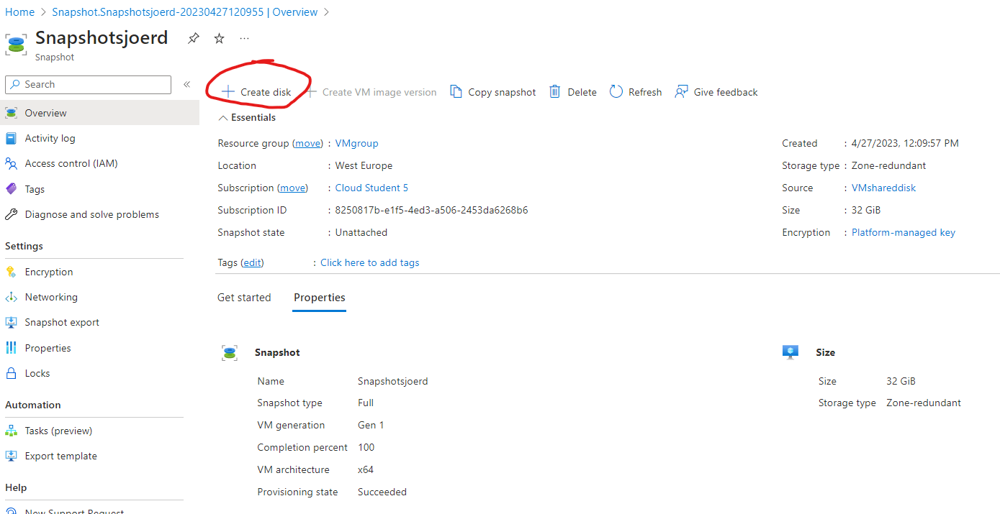

# AZ-07 Azure Disk Storage
All the disks!

## Key-terms
**OS-disk**: Ook wel system disk genoemd, waar het systeem oftewel Operating System (OS) op staat.

**Data disk**: Meestal een externe harde schijf of USB drive. Data disk zijn over het algemeen ook groter dan OS-disks en worden daarom ook gebruikt om user data als documenten,foto's, muziek en videos op te slaan. Ze zijn wel wat langzamer dan system disks omdat ze gebruikt worden voor user data en niet systeem bestanden. 

Voordelen om dus zowel OS-disk als data disk te hebben dat je systeem bestanden op 1 disk staat die snel kan handelen en alle user bestanden staan op de data disk die groter is, maar iets langzamer (maar dat is niet erg). 

**Managed vs Unmanaged disks**:

Managed Disks = are managed by Microsoft Azure and you don't need any storage account while created new disk. Since the storage account is managed by Azure you do not have full control of the disks that are being created.

Un-managed Disks = is something which requires you to create a storage account before you create any new disk. Since, the storage account is created and owned by you, you have full control over all the data that is present on your storage account. Additionally, you also need to take care of encryption, data recovery plans etc.

**(Incremental) Snapshot**:
Is een kopie van de gegevens op een opslagaccount op een bepaald moment. Het is een statisch beeld van de gegevens op dit bepaalde moment en kan worden gebruikt om back-ups/herstelpunt te maken voor VM's of schijven.

Een incremental snapshot daarentegen maakt alleen een kopie van de gegevens die zijn gewijzigd sinds het vorige snapshot. Dit betekent dat als je bijvoorbeeld dagelijks een incremental snapshot maakt, alleen de wijzigingen van de afgelopen dag worden opgeslagen. Voordeel is wel, dat de hoeveelheid opslagruimte die nodig is voor het maken van snapshots, wordt verminderd.

## Opdracht
- Start 2 Linux VMs. Zorgt dat je voor beide toegang hebt via SSH.
- Maak een Azure Managed Disk aan en koppel deze aan beide VMs tegelijk.
- Creëer op je eerste machine een bestand en plaats deze op de Shared Disk.
- Kijk op de tweede machine of je het bestand kan lezen.
- Maak een snapshot van de schijf en probeer hier een nieuwe Disk mee te maken
- Mount deze nieuwe Disk en bekijk het bestand. 

### Gebruikte bronnen
- https://docs.microsoft.com/en-us/azure/virtual-machines/disks-types
- https://www.alibabacloud.com/tech-news/data-disk/cd-what-is-the-difference-between-a-system-disk-and-a-data-disk#:~:text=System%20disks%20and%20data%20disks%20are%20two%20types%20of%20disks,on%20the%20main%20hard%20drive.
- https://learn.microsoft.com/en-us/answers/questions/3619/what-is-the-difference-between-managed-disk-and-un
- https://learn.microsoft.com/en-us/azure/virtual-machines/linux/attach-disk-portal?tabs=ubuntu
- https://learn.microsoft.com/en-us/azure/virtual-machines/disks-shared
- https://stackoverflow.com/questions/76069102/shared-disk-data-not-updating-between-linux-vms
- https://learn.microsoft.com/en-us/answers/questions/874923/why-shared-drive-is-not-showing-content-from-one-a
- https://learn.microsoft.com/en-us/answers/questions/1029604/my-data-disk-is-not-showing-in-my-vm
- https://stackoverflow.com/questions/34151446/azure-why-cant-i-find-attached-drive-on-my-vm
- https://askubuntu.com/questions/910078/structure-needs-cleaning-error-cannot-mount-partition
- https://linuxhint.com/fix-mount-point-does-not-exist-error-linux/

### Ervaren problemen
Wat ik vooral heel lastig vond om te onderzoeken of mijn disk nu daadwerkelijk shared was en hoe ik dat voor elkaar moest krijgen. 

Uiteindelijk gevonden dat je het moest 'mounten'. Dat leek makkelijk, maar voordat je dat moest doen, moet je het kennelijk formatteren. Hier raakte ik een beetje de draad kwijt. Ik heb de stappen volgens mij correct doorlopen op de learn.microsoft page, maar als ik em wil mounten dan kreeg ik allemaal errors zoals `wrong fs type, bad option, bad superblock on /dev/sdc Error`. Nu heb ik het wel werkend gekregen op 1 VM, maar niet op de andere. 

Ik heb echt hoofdpijn gekregen en na de dag afsluiting heb ik eigenlijk besloten dat ik morgen kijk of het me wel lukt. Anders alles deleten en fris weer beginnen hier aan. 

___
Dag 2. Op de ene VM was de schijf wel gepartioned, op de andere niet. Na de nodige reboots op beide VM's de schijf zichtbaar als sdc1 32g partitie en kon ik op VirtualJaap de disk mounten. Op VirtualMaarten bleef ik echter de `wrong fs type, bad option, bad superblock on /dev/sdc Error` houden wat ik bijzonder frustrerend vond. 

Door opnieuw de schijf te formatten met xfs volgens het stappen plan van microsoft en allebei de VM's de rebooten, lukte het nu wel om de disks te mounten, maar het is wel echt een zootje geworden en ik denk ook niet dat het klopt omdat de partities anders worden weer gegeven per VM. 

Ennnn ik zie het al.. nu de verkeerde disk gemount bij Jaap. Echt niet te geloven gewoon. 

Ga er niet weer een screenshot voor aanmaken, gefixed met 
`sudo mount /dev/sdb1 /datadrive` bij VirtualJaap. 

___

### Resultaat
2 Linux VM's gemaakt. VirtualMaarten en VirtualJaap. 

Apache was niet nodig voor deze opdracht, maar ik wilde weten of ik op een van deze twee opdracht 6 nog goed kon voltooien. En dat lukte. 

 
 Dan de managed shared disk. 

Dit is goed om te weten want dan weten we straks waar we op moeten letten (namelijk dat de shared disk 32G is)

Shared disk is 32g en dat is dus in dit geval `sdc`. 

Vervolgens 2 dagen lopen kloten, zie 'Ervaren Problemen'.

- Creëer op je eerste machine een bestand en plaats deze op de Shared Disk.
- Kijk op de tweede machine of je het bestand kan lezen.

Kan het tekst bestand niet lezen. Nog opgezocht en omdat te moeten kunnen, heb je eigenlijk een clustermanager nodig. Bekende daarvan is bijvoorbeeld Kubernetes. 

- Maak een snapshot van de schijf en probeer hier een nieuwe Disk mee te maken

Snapshot maken is redelijk eenvoudig, kan simpel via de Azure Portal als je de disk (in dit geval de VMsharedisk) selecteerd via *'Create Snapshot'*. 

So far so good. Nu de disk aan Maarten koppelen. Dit duurde even omdat de disk in eerste instantie niet bij 'add existing disk' wilde verschijnen. Na meerdere malen gerefreshed te hebben verscheen die gelukkig als optie.. ik begon alweer hoofdpijn te krijgen. 

Maar het gaat niet vanzelf. Kennelijk toch iets niet goed in de file structure van de snap. 

Ik heb geen idee wat ik precies aan het doen ben, behalve de commands in tikken die verschillende pagina's aanbevelen bij het troubleshooten van de error. Ik kan nu wel de Snapdisk mounten gelukkig, maar ik denk omdat ik het opnieuw moest cleanen dat je het tekst bestand wat er anders op had gestaan, nu weg is gecleaned. 

Ik denk dat ik het principe snap en waarom er OS/system disks zijn en (externe) data disks en welke waarvoor handig is. En dat je dus een snapshot of back-up in kan laden indien wenselijk. 

Hoe precies, dat moet ik dan wel echt aan een professional overlaten, maar ik laat het voor nu hierbij. Genoeg tijd aan deze opdracht verspild, op naar de volgende. 

___

### Notes to self:

`lsblk -o NAME,HCTL,SIZE,MOUNTPOINT | grep -i "sd"` = list disks op 'sd' naam

### Manieren om disk te formatten:
`sudo fdisk /dev/sdc`

of

1. `sudo parted /dev/sdc --script mklabel gpt mkpart xfspart xfs 0% 100%`

2. `sudo mkfs.xfs /dev/sdc1`

3. `sudo partprobe /dev/sdc1`

### Check integriteit
`sudo e2fsck /dev/sdd1 -y`

### Maak dir en mount disk
`sudo mkdir /datadrive`

`sudo mount /dev/sdc1 /datadrive`

