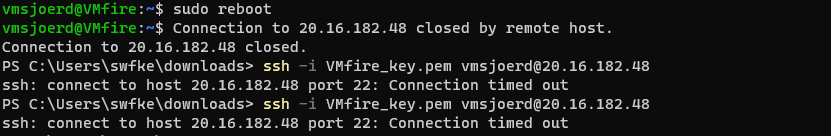

# AZ-08 Firewalls
Ook in de Cloud hebben we nog steeds muren van vuur. 

## Key-terms
- ### **Basic vs Premium Firewall**
Een **basic firewall** biedt over het algemeen minimale beveiligingsfuncties, zoals het controleren van inkomend en uitgaand netwerkverkeer, het blokkeren van ongeautoriseerde toegang tot specifieke poorten en het filteren van verkeer op basis van IP-adressen. Het kan ook eenvoudige logging- en rapportagefuncties bieden.

Een **premium firewall** kan een stuk meer en heeft geavanceerde functies voor beveiliging en beheer, zoals intrusion prevention, content filtering, VPN-ondersteuning, diepgaande pakketinspectie, geavanceerde rapportage en logging, en vaak ook meer flexibele securityregels voor accesmanagement. Een premium firewall kan ook schaalbaarder zijn en betere prestaties leveren dan een basic firewall.

Nadeel van Premium Firewall is wel, dat die duurder kan zijn in aanschaf en onderhoud. 

- ### **Firewall vs Firewall Policy**
Een **firewall** kan verschillende functies hebben, zoals het blokkeren van bepaalde poorten, het inspecteren van pakketten en het toestaan of weigeren van verkeer op basis van de herkomst, bestemming en inhoud.

Een **firewall policy** daarentegen is een **reeks regels en richtlijnen die de werking van een firewall bepalen**. Een firewall policy bepaalt hoe de firewall werkt, welke soorten verkeer er wel of niet worden toegestaan, hoe de firewall logs genereert en rapporten maakt, en wat de procedures zijn voor het beheren van de firewall.

Kortom, een firewall policy is een verzameling van regels en procedures die de firewall gebruikt om bijvoorbeeld inkomend en uitgaand netwerkverkeer te filteren en te beheren. De firewall policy is cruciaal voor het bepalen van het niveau van bescherming dat de firewall biedt, en het is belangrijk om deze regelmatig te evalueren en bij te werken om ervoor te zorgen dat de firewall blijft werken zoals bedoeld.

- ### **Azure Firewall**
Cloud-native stateful FaaS (Firewall as a Service). Omdat het een service is komt het in drie vormen (SKU): Standard, Premium en Basic. 

Omdat het van Microsoft is, is het ontworpen om (als het goed is) naadloos te integreren met andere Azure-services en -producten.

Cloud-native is ook goed om nog even terug op te komen want dat betekent dat ook de Azure Firewall: 
1. Schaalbaar is
2. Configureerbaar via Azure Portal, PowerShell of CLI. 
3. Pay-as-you-go model vs abbonement of eenmalige grote aankoopprijs van traditionele firewall. 

- ### **Azure Firewall vs NSG**
NSG of een Network Security Group en Azure Firewall maken gebruik van regels. Voor een NSG zijn dat Security rules die ook trouwens 0 kunnen zijn. 

Wat wel een groot verschil is, is dat Azure Firewall een grotere schaal werkt. Het kan verkeer tussen verschillende virtuele netwerken in Azure en het internet beheren en beveiligen. Een NSG werkt op een kleinere schaal, zoals het beperken van toegang tot een specifieke virtuele machine of subnet.

Een NSG maakt gebruik van een eenvoudigere set regels voor toegangsbeheer op basis van bron- en doel-IP-adressen, poorten en protocollen.

Zit nog verschilletje in betaalmodel. Azure Firewall heeft als cloud native een pay-as-you-go-model. Een NSG is gratis, maar er kunnen kosten verbonden zijn aan het gebruik van Azure Firewall-regels.

## Opdracht
- Zet een webserver aan. Zorg dat de poorten voor zowel SSH als HTTP geopend zijn.
- Maak een NSG in je VNET. Zorg ervoor dat je webserver nog steeds bereikbaar is via HTTP, maar dat SSH geblokkeerd wordt.

### Gebruikte bronnen
- https://learn.microsoft.com/en-us/azure/virtual-network/manage-network-security-group?tabs=network-security-group-portal
- https://learn.microsoft.com/nl-nl/azure/firewall-manager/policy-overview
- https://learn.microsoft.com/en-us/azure/virtual-network/network-security-group-how-it-works
- https://networkengineering.stackexchange.com/questions/25995/firewall-policies-vs-firewall-rules
- https://www.govinfo.gov/content/pkg/GOVPUB-C13-f52fdee3827e2f5d903fa8b4b66d4855/pdf/GOVPUB-C13-f52fdee3827e2f5d903fa8b4b66d4855.pdf
- https://learn.microsoft.com/en-us/azure/firewall-manager/policy-overview
- https://learn.microsoft.com/en-us/azure/firewall/overview

### Ervaren problemen
Geen problemen met de praktische opdracht, dat was zo gedaan omdat we de componenten eigenlijk al eerder in de opleiding hadden gedaan (Firewalls, Apache opzetten). 

### Resultaat
- Zet een webserver aan. Zorg dat de poorten voor zowel SSH als HTTP geopend zijn.

Nieuwe VM gemaakt met SSH en HTTP open. Dat is inmiddels wel gesneden koek. Bij Cloud init ook `apt install nmap -y` gezet zodat we ook meteen ports kunnen checken of ze open staan. 

Onze goede vriend Apache doet het ook, dat is toch altijd fijn om te zien. Port 80 en 22 staan inderdaad open. 

- Maak een NSG in je VNET. Zorg ervoor dat je webserver nog steeds bereikbaar is via HTTP, maar dat SSH geblokkeerd wordt.

Nieuwe NSG aanmaken is ook recht toe recht aan. Er bestaat al een default NSG bij het aanmaken van een VM, enige opletten is dus of je die wilt verhuizen naar een andere resource groep of dat je een apart resource group wilt aanmaken voor de nieuwe NSG en de VM's en bijbehorende dingen in dezelfde resource group wilt zetten. Ik probeerde de originele nsg te verwijderen, maar dat kan niet als er dingen onder draaien :)

Maar goed, we gaan de SSH dicht gooien. 

Ik kon in eerste instantie nog wel inloggen. Wist niet precies of dat lag aan Azure die wat sloom is met updaten van de NSG rules of dat het op de VM moet landen. Dan maar VM gereboot en voila, task failed succesfully. 

Apache blijft wel werken. 