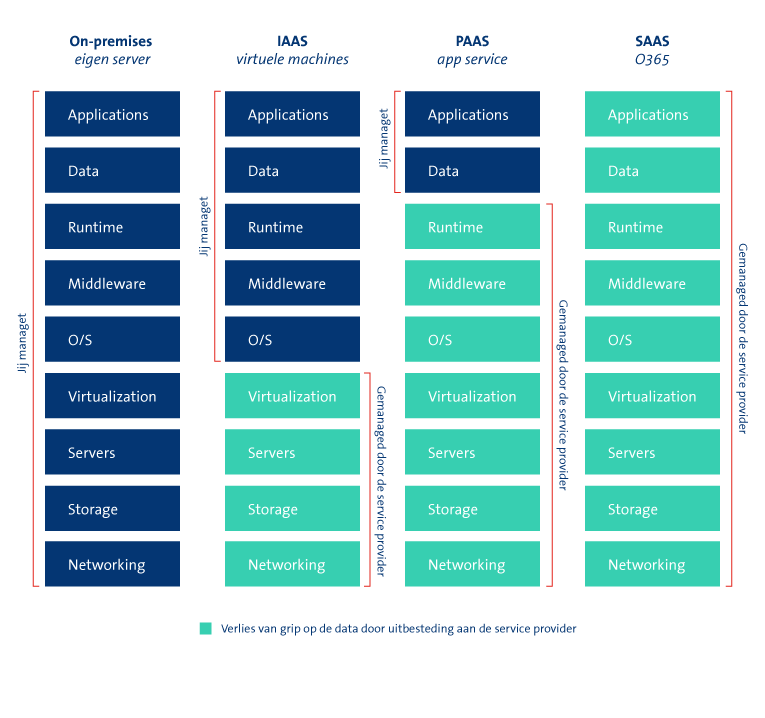

# AZ-09 Shared Responsibilities Model
Alles als een Service. En wat denk je? Ook dat bestaat. Hebben ze wel XaaS van gegeten die Cloud jongens. 

## Key-terms
### **IaaS**: Infastructure as a Service

### **PaaS**: Platform as a Service

### **SaaS**: Software as a Service. Via het internet toegang tot softwareapplicaties, meestal op abonnementsbasis.

Geen keyterms wel leuk om te weten voor het idee wat er nog meer aaS wordt aangeboden: 

- FaaS : Firewall as a Service
- MSaaS: Managed Software as a Service
- DBaaS: Database as a Service. 
- SECaaS: Je raadt het nooit, maar het is inderdaad Security as a Service. Meestal in de vorm van een abbonement.
- XaaS: Everything as a Service. Kort gezegd alles aaS tools in een (1) pakket. 

## Opdracht
- Bestudeer het Azure Shared Responsibility model

### Gebruikte bronnen
- https://www.salesforce.com/nl/learning-centre/tech/saas/
- https://blog.ogd.nl/cloudoplossingen-de-verschillen-tussen-iaas-paas-en-saas#:~:text=PaaS%3A%20hardware%2D%20en%20softwaretools%20die,internet%20of%20een%20derde%20partij.

### Ervaren problemen
Hoe populairder Cloud wordt, hoe meer '... as a Service' er bij komt. Heel interessant, maar wat een rabbithole. 

### Resultaat
We kunnen natuurlijk eindeloos typen, maar ik vind dit een van de meest overzichtelijke plaatjes over hoe het werkt:

On Prem: zelf voor alles verantwoordelijk en 0 voordelen van de Cloud.

IaaS: De Infra dat is nu de zorg van Microsoft en jij mag lekker kiezen wat je daarboven doet zolang je de rekeningen van Azure maar betaald.

PaaS: Wil je nog minder zorgen? Daar hebben we Platform as a Service voor. Dan regelt Microsoft de infra, hosting, opslag en onderhoud voor je. Je mag nog net wel zelf bepalen wat je precies qua applicaties wilt draaien.  

SaaS: Software as a service. Waar de vendor dus alles voor je regelt, inclusief de applicatie zodat de gebruiker zich alleen zorgen hoeft te maken over het daadwerkelijk gebruiken van de applicatie.

 Salesforce is denk ik een hele grote bekende hier.
