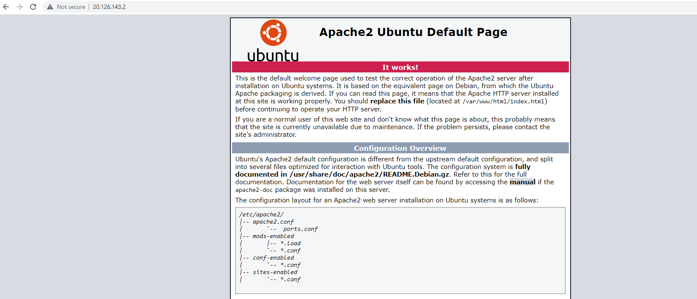

# AZ-10 Virtual Network

## Key-terms

- Point-to-site VPNs
- Site-to-site VPNs 
- Azure Expressroute (eigenlijk een directe prive kabel)

## Opdracht
### Opdracht 1:
Maak een Virtual Network met de volgende vereisten:
- Region: West Europe
- Name: Lab-VNet
- IP range: 10.0.0.0/16

- Vereisten voor subnet 1:
    - Name: Subnet-1
    - IP Range: 10.0.0.0/24
Dit subnet mag geen route naar het internet hebben

- Vereisten voor subnet 2:
    - Name: Subnet-2
    - IP Range: 10.0.1.0/24

### Opdracht 2:
- Maak een VM met de volgende vereisten:
Een apache server moet met de volgende custom data geïnstalleerd worden:

`#!/bin/bash
sudo su
apt update
apt install apache2 -y
ufw allow 'Apache'
systemctl enable apache2
systemctl restart apache2` 

- Er is geen SSH access nodig, wel HTTP
- Subnet: Subnet-2
- Public IP: Enabled
- Controleer of je website bereikbaar is

### Gebruikte bronnen
- https://learn.microsoft.com/en-us/azure/virtual-network/quick-create-portal
- https://learn.microsoft.com/en-us/azure/virtual-network/diagnose-network-routing-problem
- https://learn.microsoft.com/en-us/azure/virtual-network/virtual-networks-udr-overview
- https://learn.microsoft.com/en-us/azure/virtual-network/virtual-network-network-interface?tabs=azure-portal#view-network-interface-settings

### Ervaren problemen
Ik krijg geen connectie op het public IP van mijn VM. Zo ver ik de troubleshooter van Azure Portal snap, ligt het aan het feit dat ik nu wel een netwerk heb, maar dat ik iets moet aanpassen in of network interface of een route table nodig heb. 

Na een wat langere pauze bedacht ik me dat het wellicht ook aan de firewall of in dit geval de NSG kan liggen. Inderdaad, http stond nog niet open. 

Toch bleef ik probleem houden dat website niet kon worden bereikt. 
Toen ik ging scrollen door de portal kwam ik een topology tegen waarin meteen duidelijk werd dat ik iets mis om ook naar het internet te gaan. 
Ik heb natuurlijk iets nodig om mijn netwerk naar het internet te verbinden. Bv een NAT gateway. 

Alles gedelete en opnieuw begonnen met aanmaken vnet en in beide subnets NAT gateway gezet. Dat werkt. Enige verschil nu is dat ik nog wel iets moet verzinnen om voor subnet 1 het internet echt uit te zetten. Met NSG kan ik de regels natuurlijk denien, maar technisch gezien staat het wel open. 

Toen ik eigenlijk net klaar hiermee was hoorde ik in de Q&A dat eigenlijk de bedoeling is dat je dit zou moeten doen met routetable...

Het is inmiddels 13:45. Omdat we ook met het team hebben afgesproken om de sprint retro om 15:00 te doen en ik daarna ook nog scrummeeting om 16:00 heb, heb ik niet bijzonder veel tijd om hier nog heel erg in te duiken. In het weekend heb ik namelijk ook de nodige verplichtingen. 

Laten we een poging wagen. 

Ik kan me voorstellen dat je het via de routetable ongeveer zo instelt met rules om verkeer tussen meerdere (private) Vnet of netwerken te maken en dus ook VPN of Expressroutes toe te voegen en waar het naar toe moet. 

Wellicht dat je hier ook een regel kan schrijven om default Internet toegang naar hop: none te gooien. 

Ik zal hier op een ander moment meer naar moeten kijken. 

### Resultaat
Vnet creeren zelf ging vrij makkelijk in de portal. Het is vooral opletten dat je de subnets goed invult. 

