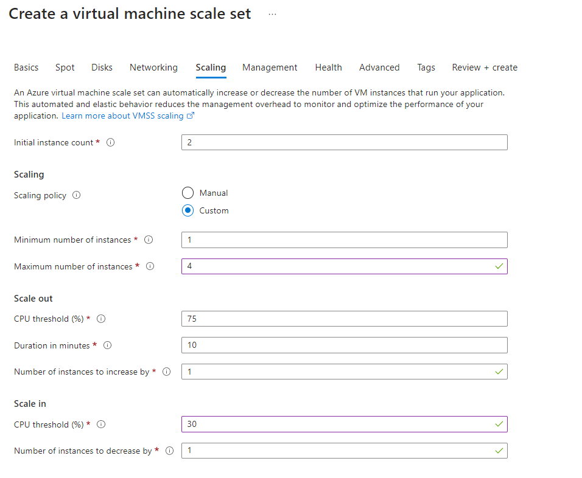
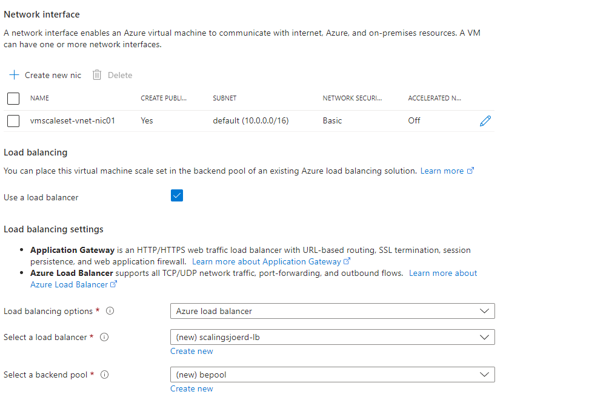
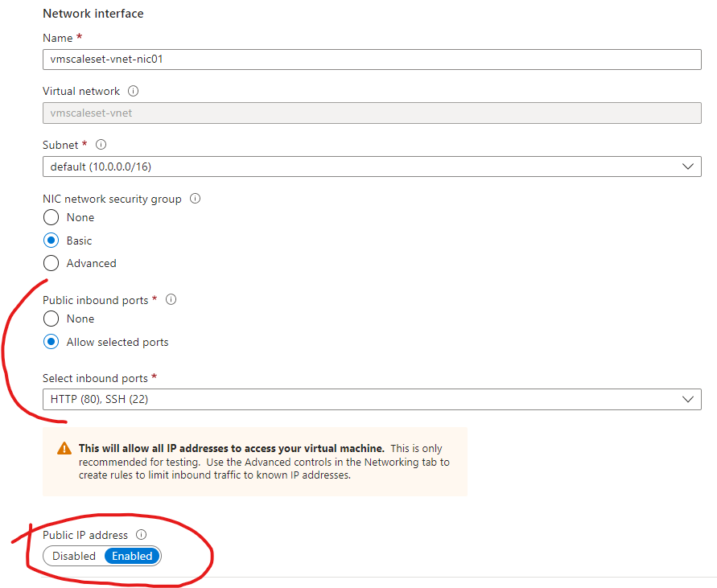
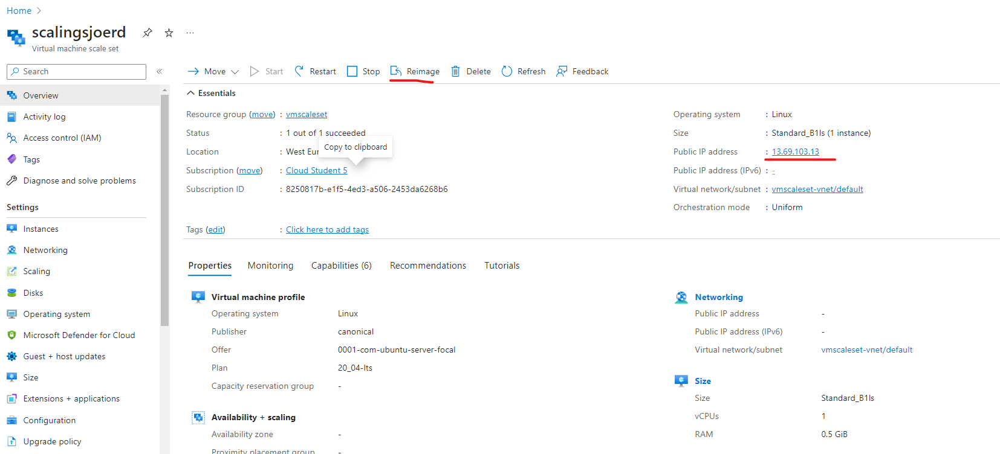
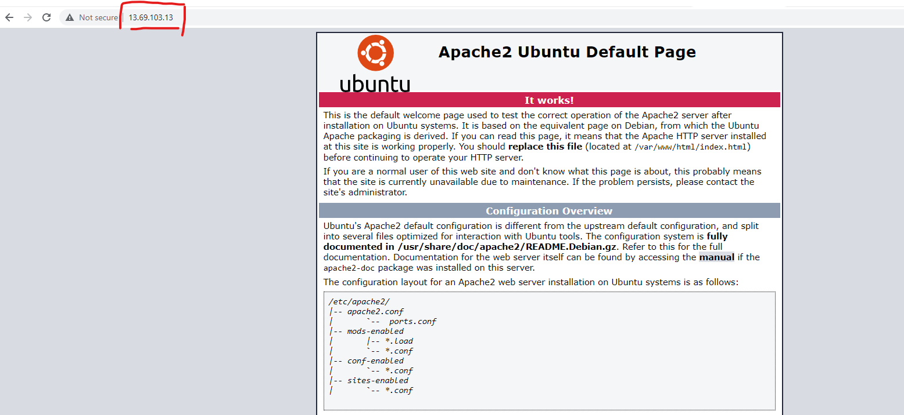
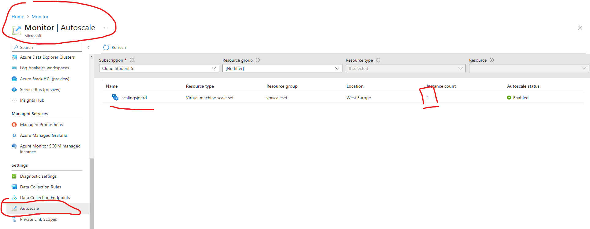
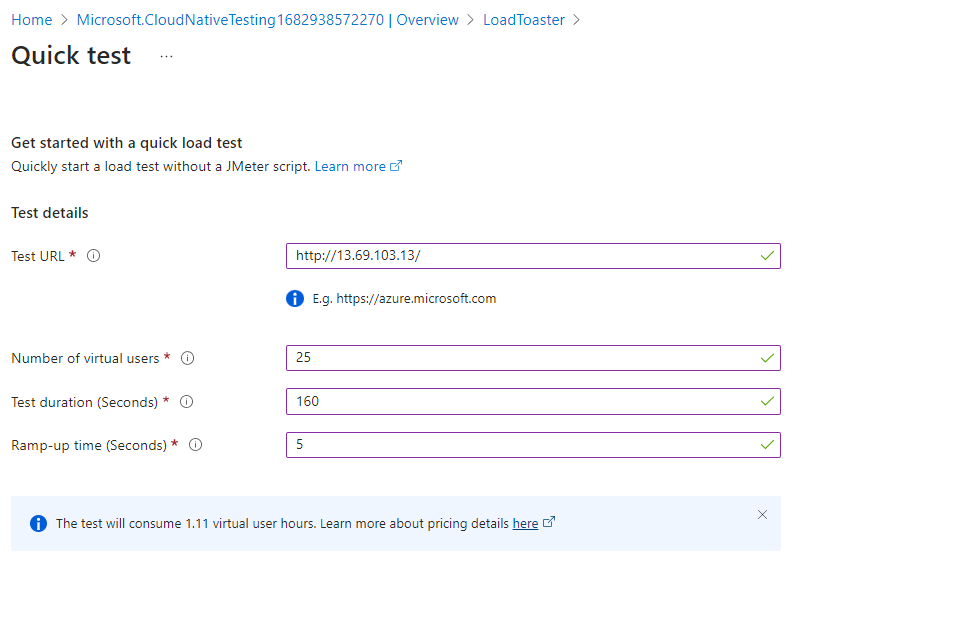
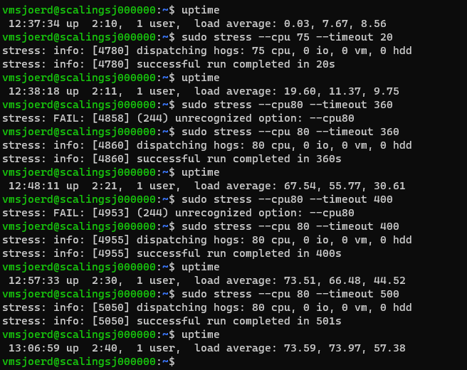
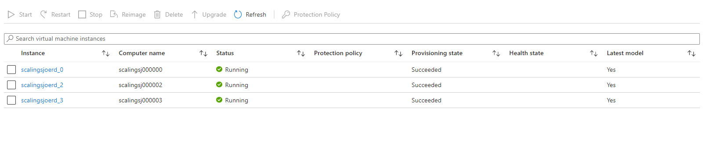
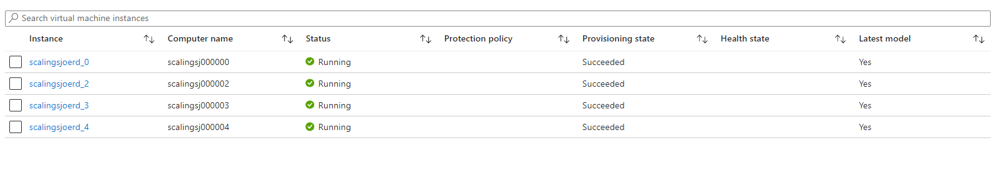

# AZ-11 Azure Load Balancer (ALB) en Auto Scaling
Groeien of krimpen met een Load Balancer en het testen met een load tester. Klinkt net als een wasmachine.

## Key-terms
### **(Azure) Load Balancer**:
Ideaal voor het managen van traffic naar servers. Als je de load balancer als end point voor clients zet dan bepaald de load balancer naar welke server het verkeer gaat. In combinatie met autoscaling krijgen we dan helemaal mooie dingen. 

### **Autoscaling**:
Het principe in de Cloud dat je on-demand kan scalen. Dit geld zowel voor upscalen als er meer capaciteit nodig is, als downscalen tijdens dal uren. Hier kan je met scale set condities schrijven die auto scaling het werk laat doen. Meteen mooi bruggetje naar de volgende key-term. 

### **VM scale set**:
Met meerdere VM's gebruik je een image (blauwdruk/preset) bij het configureren zodat alle VM's binnen de scale set gelijk zijn. Dit kan eventueel naar wens nog worden aangepast met een reimage optie. 

Auto scaling maakt in principe allen gebruik van horizontal scaling, je kan er dus meer of minder VM's bijzetten. 

Mocht je toch verticaal willen scalen dan zal je de image moeten aanpassen, alle VM's stoppen en de nieuwe config met nieuwe VM's moeten aanzwengelen. 

## Opdracht
Maak een Virtual Machine Scale Set met de volgende vereisten:
- Ubuntu Server 20.04 LTS - Gen1
- Size: Standard_B1ls
- Allowed inbound ports:
- SSH (22)
- HTTP (80)
- OS Disk type: Standard SSD
- Networking: defaults
- Boot diagnostics zijn niet nodig
- Custom data:

`#!/bin/bash
sudo su
apt update
apt install apache2 -y
ufw allow 'Apache'
systemctl enable apache2
systemctl restart apache2`

- Initial Instance Count: 2
- Scaling Policy: Custom
- Aantal VMs: minimaal 1 en maximaal 4
- Voeg een VM toe bij 75% CPU gebruik
- Verwijder een VM bij 30% CPU gebruik

### Gebruikte bronnen
- https://spot.io/resources/azure-pricing/azure-autoscaling-a-practical-guide/
- https://learn.microsoft.com/en-us/azure/azure-monitor/autoscale/autoscale-get-started
- https://learn.microsoft.com/en-us/azure/virtual-machines/linux/tutorial-create-vmss
- https://learn.microsoft.com/en-us/azure/load-testing/quickstart-create-and-run-load-test
- https://www.loadview-testing.com/blog/testing-microsoft-azure-autoscale/

### Ervaren problemen
Tot en met de load testing ging het vrij makkelijk. Ik vond onduidelijk op welke manier je de load test moest gebruiken om de auto scale in werking te laten treden. Uiteindelijk tip gekregen in de Q&A dat het ook via inloggen op machine kon en daar stress command kon gebruiken.  

Dat bleek de gouden tip. 

Was heel blij toen ik zag dat de scale set er VM's bij maakte. 

### Resultaat

Gaan we. 

Volgens de specificaties vullen we het netjes in.

We moeten een load balancer hebben dus laten we die hier meenemen. 

En laten we er hier ook voor zorgen dat we port 80 en 22 weer open hebben en dat we een public IP hebben. 

Scaling set aangemaakt.
Waar we het in de theorie hierboven al kort over hadden, eventueel reimagen van je instances (in dit geval VM's) kan daar. Ook zie je het public IP van de loadbalancer, en daar willen we het verkeer naar toe sturen. 

Eerst checken op de standaard Apache website het doet. Als we de IP van de loadbalancer inkloppen dan krijgen we dat keurig te zien. 

We kunnen ook nog via de Azure Monitor in de gaten houden of auto scale aan staat.

Dan moeten we nog auto scale condities triggeren. Scale down is al gelukt want we begonnen met het aanmaken van 2 instances, en nu is er 1 actief. Moeten we alleen nog kunnen aantonen dat naar boven up scalen ook werkt. 

Eerst Azure load test geprobeerd. 

Achteraf gezien te korte runtime genomen, ik zie bijvoorbeeld wel dat er wat gebeurd met CPU load bij de overview/monitoring tab, maar ik zie niet gebeuren dat er een VM bij komt. 

Nadat we dus in de Q&A de tip kregen dat het niet alleen via de Load Test mogelijk was maar ook via CLI, heb ik toch via SSH ingelogd om daar te proberen om de juiste parameters in te kloppen zodat de autoscaling aan ging. 

Moest nog wel de stress package downloaden, maar dit ging vrij soepel met `sudo apt-get install stress`. 

Vervolgens beetje inlezen hoe we de machine kunnen opblazen binnen 5 minuten zodat de autoscaling triggert. 

 

Dat was nog wat uit proberen. Uiteindelijk ging de autoscaling ook echt werken bij de laatste test met 500 seconden. 

Bij een eerste refresh gingen er 3 aan.

En vervolgens zelfs 4. 