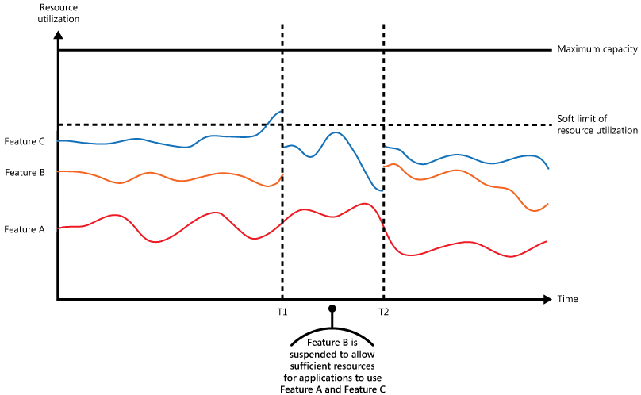

# AZ-12 Well Architected Framework
Alles begint bij het begin. Vooral een goed uitgedacht begin. 

## Key-terms
De hele opdracht draait hierom en het is een aardige berg theorie. 

Gelukkig hebben we voor de theorie een bruggetje: **CROPS**. De rest volgt in het Engels want dat is wat makkelijker examen stof oefenen en begrijpen. 

___

## **Cost optimization**:
With what we learned so far this seems pretty straight forward. Keep in mind the following though:

- **Develop a cost model**
- **Create budgets and alerts**
- Use a **[savings plan](https://learn.microsoft.com/en-us/azure/cost-management-billing/savings-plan/) for high dynamic workloads**.
- For **predicitable workloads** you can opt to use [Azure reservations](https://learn.microsoft.com/en-us/azure/cost-management-billing/reservations/save-compute-costs-reservations).
- **Have a scale-in and scale-out policy**. Increasing customer base shouldn't require more investment in infrastructure. Conversely, if demand drops, scale-down unused resources. 
- In general, **review the underutilized resources**. Resize or shutdown appropriately. 
- For discount prices, you can use Azure Reservations or Azure [Hybrid Benefit](https://azure.microsoft.com/en-us/pricing/hybrid-benefit/).
- **Reevaluate design choices**.Analyze the cost reports and forecast the capacity needs. You might need to change some design choices. Some sub choices may involve:
    - **Choose the right storage tier**. Consider using hot, cool, and archive tiers for storage account data. Storage accounts can provide automated tiering and lifecycle management.
    - **Choose the right data store**. Instead of using one data store service, use a mix of data store depending on the type of data you need to store for each workload. 
    - **Choose Spot VMs for low priority workloads**. Spot VMs are ideal for workloads that can be interrupted, such as highly parallel batch processing jobs.
    - **Optimize data transfer**. Only deploy to multiple regions if your service levels require it for either availability or geo-distribution. Data going out of Azure data centers can add cost because pricing is based on billing zones.
    - Reduce load on servers. **Use Azure Content Delivery Network (CDN) and caching service** to reduce load on front-end servers. Caching is suitable for servers that are continually rendering dynamic content that doesn't change frequently.
    - **Use managed services.** Measure the cost of maintaining infrastructure and replace it with Azure platform as a service **(PaaS**) or software as a service **(SaaS)** services.

___
## **Reliability**:
In my own words I would say: in order to make sure that you yourself can maintain a high SLA performance, you need to think about the resiliency of the architecture framework. 

Through regions, region pairs and availability zones and cross region support you already can build in a lot of reliability for your systems, to make sure your RPO or RTO is very little to none.

Make sure to think about single points of failure. If you have a single firewall between multiple servers an a load balancer(s), that might be a bottleneck. 

If we translate that roughtly into bulletpoints:
- **Design for Business/Application requirements**. For example, a mission-critical application with a 99.999% service level agreement (SLA) requires a higher level of reliability than another application with an SLA of 95%.In addition, cost implications are inevitable when introducing greater reliability and high availability. This trade-off should be carefully considered.
- **Design for failure**. By anticipating failures, from individual components (switches, racks, cables) to entire Azure regions, you can develop a solution in a resilient way to increase reliability.
- **Observe application health**. By monitoring the operation of an application relative to a healthy state, you can detect and predict reliability issues. So in non-corpo speak: if your application is getting clogged up or slow, monitor and analyse the culprits and take action. And preferably see the trend happening and take action *before* the application actually is getting clogged up. 
- **Drive automation**. 
Humans make errors, it's ment to happen sooner than later. One of the leading causes of application downtime is human error due to the deployment of insufficiently tested software or through misconfiguration.
To minimize this, it's vital to strive for automation in all aspects of a cloud solution. Assuming your scripts or configs are not riddled with errors by humans, automation improves:
    - Reliability
    - Automated testing
    - Deployment
    - Management

- **Design for self-healing**. Restoration healing skill for computers? Are we wizards now, Harry? Sort of. Self-healing describes the ability of a system to deal with failures automatically. Handling failures happens through pre-defined remediation protocols. These protocols connect to failure modes within the solution. 
In other words: have an automated alternative for a certain failure, so business can continue as usual. Don't have a possible single point of failure because that is asking for trouble sooner or later. 

- **Design for scale-out (horizontal scaling)**:
Through scale units, a system can handle expected and unexpected traffic increases, essential to overall reliability.
Scale units further reduce the effects of a single resource failure.

___

## **Operational excellence**:
How to keep the operation running, and better, how to make it run smoothly. 

- **Application Design**. Provides guidance on how to design, build, and orchestrate workloads with DevOps principles in mind.
This seems a no-brainer but make sure you **have different development environments**. You should at the least have 2 (1 dev and 1 live/prod environment) and preferably more. In addition ask yourself:
    - How do I ensure that all dependencies are in place?
    - How can I best configure my development environment to emulate a production environment?
    - How do I develop code where service dependencies may exist with code already in production?

    **Source control management (SCM)** systems provide a way to control, collaborate, and peer review software changes. As software is merged into source control, the system helps manage code conflicts. Ultimately, source control provides a running history of the software, modification, and contributors. Whether a piece of software is open-sourced or private, using source control software has become a standardized method of managing software development.

    As cloud practices are adopted and because so much of the cloud infrastructure is managed through code, version control systems are an integral part of infrastructure management.

    Many source control systems are powered by Git and therefore use GitHub.

- **Monitoring**. Monitoring and diagnostics are essential to any workload. Specifically for cloud applications that run in a remote datacenter often this discipline becomes even more crucial.
Why is monitoring important:
    - Ensure the system remains healthy
    - Track the availability of the system and its components
    - Guarantuee the system meets any SLA established with customers
    - Protect the privacy and the security of the system, users and their respective data. 
    - Monitor the day-today- usage of the system and spot trends that might lead to problems if not addressed. 
    - Trace operations and debug software releases.

- **App performance management**. The monitoring and management of performance, and availability of software applications through DevOps.
    This mostly applies to builds. 
    Build status shows if your product is in a deployable state, so builds are the heartbeat of your continuous delivery system.ince builds provide such crucial information about the status of your product, you should always strive for fast builds.

    What types of builds your organization needs depends on many factors including your team's and organizational maturity, the kind of product you are working on, and your deployment strategy.

- **Code deployment:** How you deploy your application code is one of the key factors that determines your application stability.
   - To automate provisioning of Azure resources, you can use Terraform, Ansible, Chef, Puppet, Azure PowerShell, Azure CLI, Azure Resource Manager templates, or Azure Deployment Environments.
    - To configure VMs, you can use cloud-init (for Linux VMs) or Azure Automation State Configuration (DSC).
    - To automate application deployment, you can use Azure DevOps Services, Jenkins, or other CI/CD solutions.

    As you provision and update Azure resources, application code, and configuration settings, a repeatable and predictable process will help you avoid errors and downtime. We recommend automated processes for deployment that you can run on demand and rerun if something fails. 

    The most reliable deployment processes are automated and *idempotent* — that is, repeatable to produce the same results.
 
    **As a best practice, create a repository of categorized automation scripts for quick access, documented with explanations of parameters and examples of script use.** Keep this documentation in sync with your Azure deployments, and designate a primary person to manage the repository.

    Automation scripts can also activate resources on demand for disaster recovery.
    
    **Stage your workloads**

    Deployment to various stages and running tests/validations at each stage before moving on to the next ensures friction free production deployment.

    With good use of staging and production environments, you can push updates to the production environment in a highly controlled way and minimize disruption from unanticipated deployment issues.

- **Infrastructure provisioning**. Frequently known as  **Deployment Automation** or **Infrastructure as code  (IaS)**, this discipline refers to best practices for deploying the platform where your application will run.

    **IaC is the management of infrastructure**- such as virtual machines, load balancers, and connection topology - in a descriptive model, using a versioning system that is similar to what is used for source code. When you're creating an application, the same source code will generate the same binary every time it is compiled. In a similar manner, an IaC model generates the same environment every time it is applied. IaC is a key DevOps practice, and it is often used with continuous delivery.

    Ultimately, IaC allows you and your team to develop and release changes faster, but with much higher confidence in your deployments.

- **Testing**: Testing is fundamental to prepare for the unexpected and to catch mistakes before they impact users.
There are many, many forms of testing. 
    - **Automated Testing**
        - **Unit Testing** *(Unit tests are tests typically run as part of the continuous integration routine. Unit Tests should be extensive (ideally cover 100% of the code) and quick (run in under 30 seconds, although this number is a guideline)). Unit testing can verify that the syntax and functionality of individual modules of code are working the way they should.*
        - **Smoke Testing** *(Smoke tests verify that a workload can be stood up in a test environment and performs as expected. They don't go to the extent of integration tests as they don't verify the interoperability of different components.Instead they verify that the deployment methodology for both infrastructure and the application works and that the system responds as intended once the process is complete.)*
        - **Integration Testing** (Itegration testing has as goal to determine whether components can interact with each other as they should.
        Running a large integration test suite can take a considerable amount of time, which is why tests should be shifted left as much as possible, with integration tests being reserved to scenarios that cannot be tested with a smoke or unit test.
        Long running test processes can be run on a regular interval if needed. This offers a good compromise, detecting interoperability issues between application components no later than one day after they were introduced.)
    - **Manual Testing** *(is fundamental for the correct functioning of the DevOps feedback loop, to correct errors before they become too expensive to repair, or cause customer dissatisfaction.)*
    - **Acceptance Testing** *(Depending on the context acceptance testing is sometimes performed manually. In some cases it's partially or fully automated. The main purpose of this test is to evaluate the system's compliance with the business requirements and verify if it has met the required criteria for delivery to end users.)*
    - **Stress Testing** *(Can vary if this is done manually or automated. In essence; you want to know bottlenecks in the system/application and how the environment reacts to changing load conditions. Autoscale anybody?)*

**Testing and Experimentation in Production**.

I know, I know. What could possibly go wrong, right?

There are multiple popular approaches to experimentation in production:

**Blue/Green deployments**: When deploying a new application version, you can deploy it in parallel to the existing one. This allows you to start redirecting clients to the new version, and if everything goes well you can then decommission the old version. If there is any problem with the new deployment, you can always redirect the users back to the deployment with the previous version.

**Canary releases**: You can expose new functionality of your application in a staggered way to select groups of users. If users are satisfied with the new functionality, or if the new feature performs as expected with the control group, you can extend the feature to a larger group of users until it's fully rolled out.

**A/B testing**: A/B testing is similar to canary release-testing, but while canary releases focus on mitigate risk, A/B testing focus on evaluating two versions of an application or feature side by side. For example, if you have two versions of the layout of a certain area of your application, you could send half of your users to one, the other half to the other, and use some metrics to see which layout is more successful in the context of your business goals.

___

## **Performance efficiency**:

- Autoscaling (how to in Azure) 
    - **Azure Virtual Machines** autoscale via virtual machine **scale sets**, which manage a set of Azure virtual machines as a group.
    - **Service Fabric** also supports autoscaling through virtual machine scale sets. Every node type in a Service Fabric cluster is set up as a separate virtual machine scale set. That way, each node type can be scaled in or out independently.
    - **Azure App Service** has built-in autoscaling. Autoscale settings apply to all of the apps within an App Service.
    - **Azure Cloud Services** has built-in autoscaling at the role level.

**Use Azure Monitor autoscale**
Azure Monitor autoscale provide a common set of autoscaling functionality for virtual machine scale sets, Azure App Service, and Azure Cloud Service. Scaling can be performed on a schedule, or based on a runtime metric, such as CPU or memory usage.

Keep in mind that **autoscaling might not be the most appropriate mechanism to handle a sudden burst in workload**. It takes time to provision and start new instances of a service or add resources to a system, and the peak demand may have passed by the time these additional resources have been made available. In this scenario, it may be better to **throttle** the service.

**Throttling**: 

If the critical function of feature C reaches the soft limit for resource capacity, the non-critical feature B is suspended temporarily. This makes sure that critical features A and C can continue without risk of running out of resources. When feature C has finished it's short peak and there is enough resource capacity as per the set parameters, the throttle ends and feature B can resume running. 

- Background jobs
Background jobs typically include one or more of the following types of jobs:

    - **CPU-intensive jobs**, such as mathematical calculations or structural model analysis.
    - **I/O-intensive jobs**, such as executing a series of storage transactions or indexing files.
    - **Batch jobs**, such as nightly data updates or scheduled processing.
    - **Long-running workflows**, such as order fulfillment, or provisioning services and systems.
    - **Sensitive-data processing** where the task is handed off to a more secure location for processing. For example, you might not want to process sensitive data within a web app. 

Background jobs can be triggered by either an **event-driven trigger** or **schedule-driven trigger**.

- **Caching**

Caching is a common technique that aims to improve the performance and scalability of a system. It caches data by temporarily copying frequently accessed data to fast storage that's located close to the application. If this fast data storage is located closer to the application than the original source, then caching can significantly improve response times for client applications by serving data more quickly.

**Caching in distributed applications**

Distributed applications typically implement either or both of the following strategies when caching data:

- They use a **private cache**, where data is held locally on the computer that's running an instance of an application or service.
- They use a **shared cache**, serving as a common source that can be accessed by multiple processes and machines.

- CDN

- Data partitioning

- ## **Security**:
As a Cloud Engineer you will need to take several security principles into account. This means make use of;

- Make use of IAM (Identity and Access Management) through Multi-Factor Authentication (MFA) and ARBAC (Azure Role Based Acces Control).  
    - Make use of principle of least privilege. 

   

## Opdracht
Bestudeer: 
- Well-Architected Framework van Azure
- Hoe je elke pilaar kan implementeren met cloud-diensten

### Gebruikte bronnen
- [John Savill over Well Architected Framework basics met meer focus op SLA targets.](https://www.youtube.com/watch?v=lQlHWacM1N0)
- https://learn.microsoft.com/en-us/azure/well-architected/ en alle daar uit voortvloeiende subpagina's. 
- https://learn.microsoft.com/en-us/azure/architecture/best-practices/auto-scaling
- https://learn.microsoft.com/en-us/azure/architecture/patterns/throttling

### Ervaren problemen
Geen echte problemen, behalve dat je ook hier weer zo diep kan duiken als je zelf wilt. Ik heb persoonlijk wel echt de tijd ervoor genomen want ik denk als ik hier een mooi stukje van maak, dat ik hier profijt van ga hebben de rest van mijn opleiding. Terwijl ik de documentatie lees worden er steeds meer stukjes van de puzzel ontrafelt. 

### Resultaat
Ik denk dat de termen al redelijk voor zich spreken, maar het is fijn om wat video's er over te kijken om het beter te snappen in het grotere geheel. Ik blijf het zeggen maar John Savill is echt een topgozer voor het uitleggen van Azure dingen. En ik merk dat ik nu ook echt steeds **meer** snap van wat John uitlegt. 