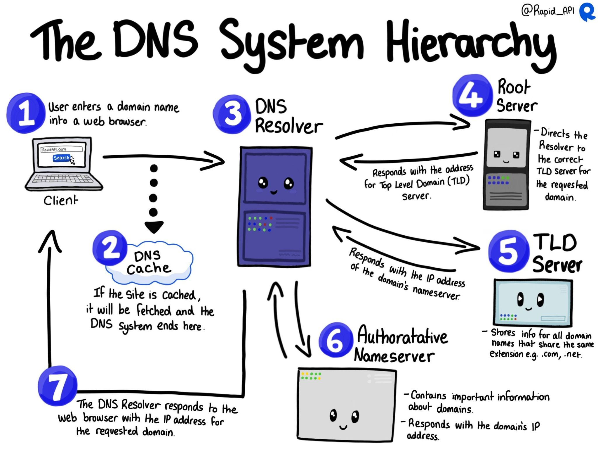
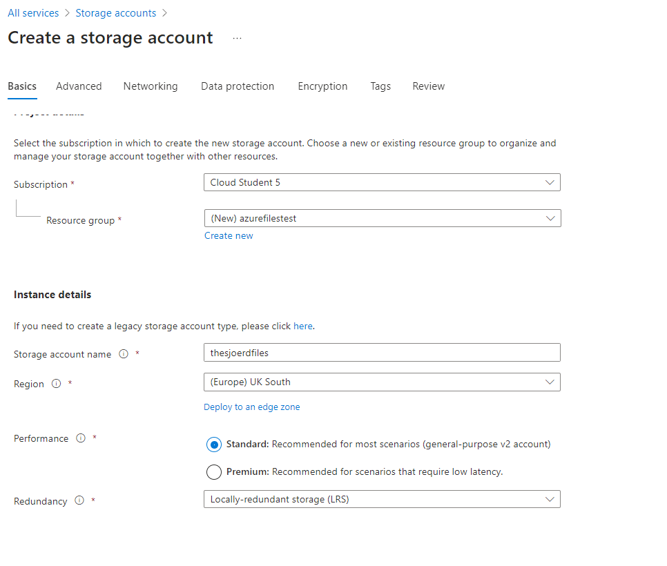
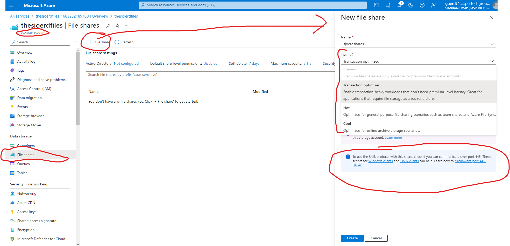
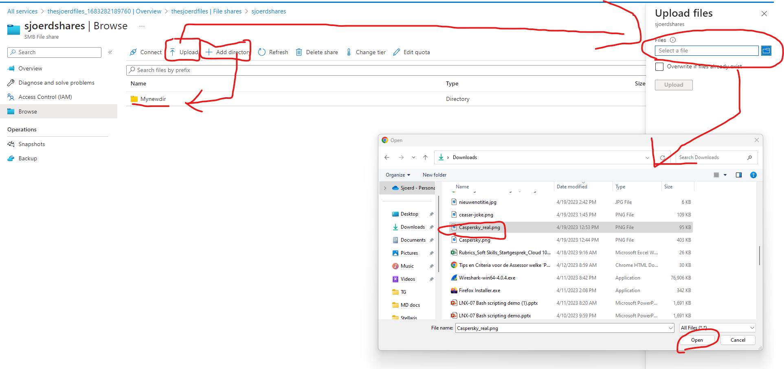
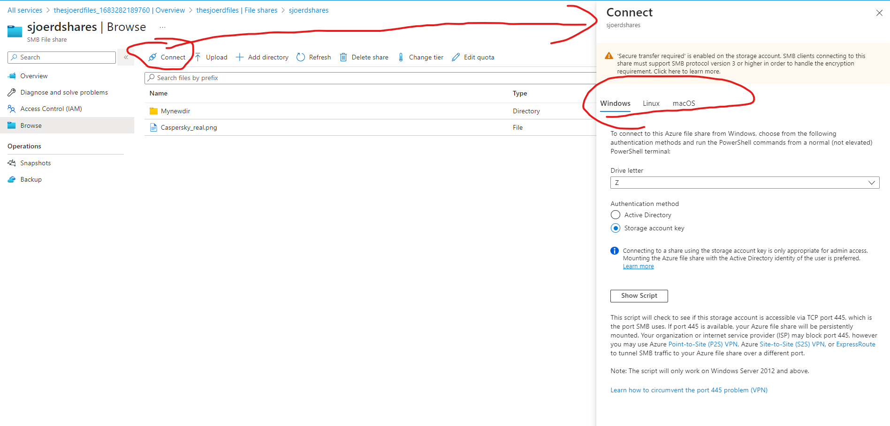
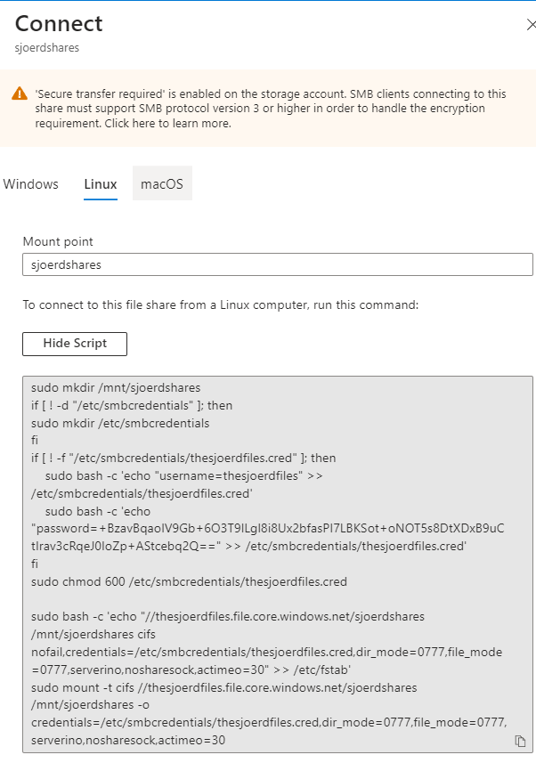
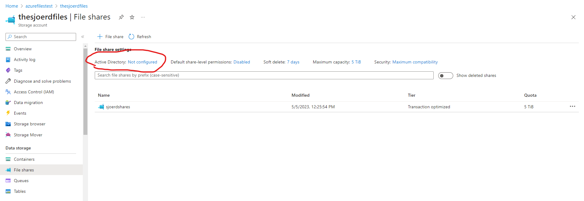
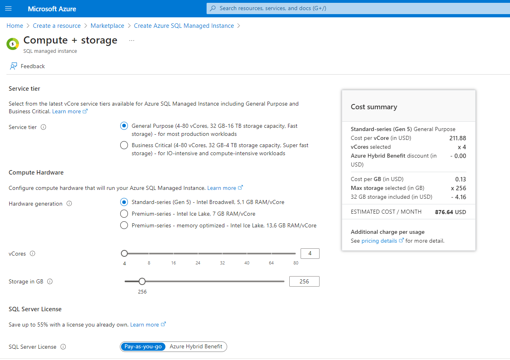
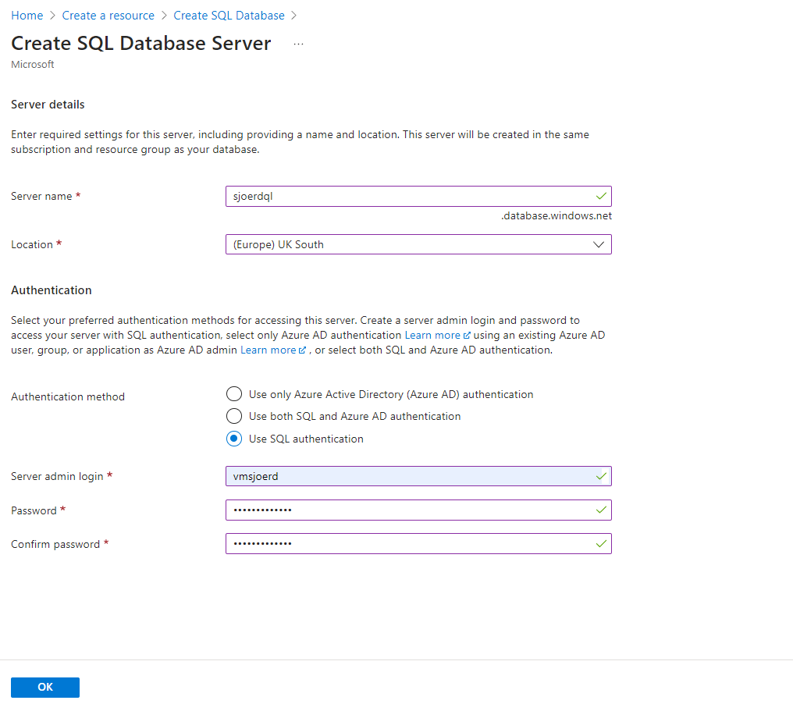
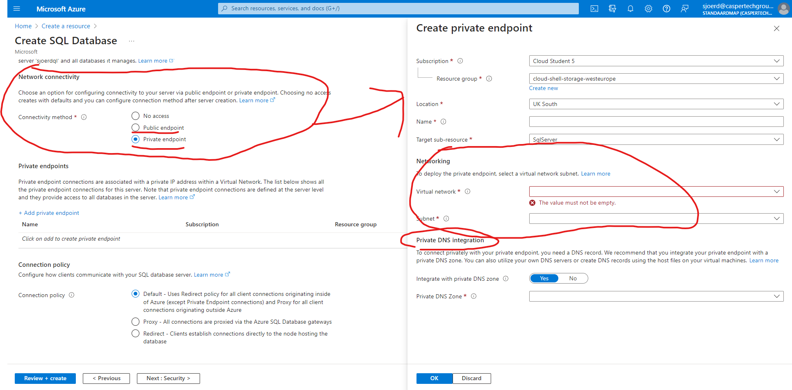

# AZ-13 Files,AppServices,CDN,DNS+Database
Bij netwerk problemen ligt het altijd aan DNS. Ik zweer het je.  

## Key-terms
## **Azure App Service**: 

Azure App Service is a fully managed platform as a service **(PaaS)** offering for developers.

Azure App Service is an **HTTP-based service for hosting web applications, REST APIs, and mobile back ends**. You can develop in your favorite language, be it .NET, .NET Core, Java, Ruby, Node.js, PHP, or Python. Applications run and scale with ease on **both Windows and Linux-based environments**.

App Service adds the power of Microsoft Azure to your application, such as security, load balancing, autoscaling, and automated management. Additionally, you can take advantage of its DevOps capabilities, such as continuous deployment from Azure DevOps, GitHub, Docker Hub, and other sources, package management, staging environments, custom domain, and TLS/SSL certificates.

Benefits of Azure App service:
- **Managed production environment** -  App Service automatically patches and maintains the OS and language frameworks for you. Because it is a PaaS you don't need to worry about the physical underlying infrastructure up until OS. 
- **Containerization and Docker** - Dockerize your app and host a custom Windows or Linux container in App Service. Run multi-container apps with Docker Compose. Migrate your Docker skills directly to App Service.
- **Global scale with high availability** - Scale up or out manually or automatically. Host your apps anywhere in Microsoft's global datacenter infrastructure, and the App Service SLA promises high availability.
- **Application templates** - Choose from an extensive list of application templates in the Azure Marketplace, such as WordPress, Joomla, and Drupal.
- **API and mobile features**- App Service provides turn-key CORS support for RESTful API scenarios, and simplifies mobile app scenarios by enabling authentication, offline data sync, push notifications, and more.
- **Serverless code** - Run a code snippet or script on-demand without having to explicitly provision or manage infrastructure, and pay only for the compute time your code actually uses (see Azure Functions).
- **Connections to SaaS platforms and on-premises data** - Choose from many hundreds of connectors for enterprise systems (such as SAP), SaaS services (such as Salesforce), and internet services (such as Facebook). Access on-premises data using Hybrid Connections and Azure Virtual Networks.

In my own words: because Azure App Service is a PaaS, you don't need to worry about updating your host OS or language frameworks, which is nice. Because you can spend that time developping your website/server/application. 

App Service has of course benefits of the clouds which means high elasticy with autoscaling, high scalability in general and high availability and redundancy. 

Furthermore App service has integrated certain other popular development apps; meaning you can use GitHub and Visual Studio Code to make sure your code reaches the places it needs to be.
Samething for containerization, App services has Docker integration.  

Because it is focused as a development enviroment, you can work well with DevOps practices for more streamlining of your development cycles. 

___

## **Content Delivery Network (CDN)**:
A content delivery network (CDN) is a distributed network of servers that can efficiently deliver web content to users. A CDN store cached content on edge servers in point-of-presence (POP) locations that are close to end users, to minimize latency.

Benefits of a CDN:
- Better performance and improved user experience for end users, especially when using applications where multiple round-trips requests required by end users to load contents.
- Large scaling to better handle instantaneous high loads, such as the start of a product launch event.
- Distribution of user requests and serving of content directly from edge servers so that less traffic gets sent to the origin server.

How does it work generally?

1. A user (Alice) requests a file (also called an asset) by using a URL with a special domain name, such as <endpoint name>.azureedge.net. This name can be an endpoint hostname or a custom domain. The DNS routes the request to the best performing POP location, which is usually the POP that is geographically closest to the user.

2. If no edge servers in the POP have the file in their cache, the POP requests the file from the origin server. The origin server can be an Azure Web App, Azure Cloud Service, Azure Storage account, or any publicly accessible web server.

3. The origin server returns the file to an edge server in the POP.

4. An edge server in the POP caches the file and returns the file to the original requestor (Alice). The file remains cached on the edge server in the POP until the time-to-live (TTL) specified by its HTTP headers expires. If the origin server didn't specify a TTL, the default TTL is seven days.

5. More users can then request the same file by using the same URL that Alice used, and gets directed to the same POP.

6. If the TTL for the file hasn't expired, the POP edge server returns the file directly from the cache. This process results in a faster, more responsive user experience.

___

## **Azure DNS** 
Azure DNS is a hosting service for DNS domains that provides name resolution by using Microsoft Azure infrastructure. By hosting your domains in Azure, you can manage your DNS records by using the same credentials, APIs, tools, and billing as your other Azure services.

You **can't use Azure DNS to buy a domain name**. For an annual fee, you **can buy a domain name by using App Service** domains or a third-party domain name registrar. Your domains then can be hosted in Azure DNS for record management.

**Domain management**\
Your domains and records can be managed by using the Azure portal, Azure PowerShell cmdlets, and the cross-platform Azure CLI. **Applications that require automated DNS management can integrate with the service by using the REST API and SDKs.**

DNS vertaalt een domain (google.com) naar iets wat een computer snapt; een IP adres als 8.8.8.8. 

Over DNS hebben we het nog niet heel veel gehad dus als algemeen begrip hier nog een plaatje ter ondersteuning.

### **Alias Records**

Azure DNS supports alias record sets. **You can use an alias record set to refer to an Azure resource**, such as an **Azure public IP address**, an Azure Traffic Manager profile, or an **Azure Content Delivery Network (CDN) endpoint.** If the IP address of the underlying resource changes, the alias record set seamlessly updates itself during DNS resolution. The alias record set points to the service instance, and the service instance is associated with an IP address.

### **Customizable virtual networks with private domains**
Azure DNS also supports private DNS domains. **This feature allows you to use your own custom domain names in your private virtual networks** rather than the Azure-provided names available today.

___

## Opdracht
Bestudeer:
- App Service 					/ Elastic Beanstalk
- Content Delivery Network (CDN) 		/ CloudFront
- Azure DNS 					/ Route53

Doe iets leuks met:
- Azure Files					/ EFS				
- Azure Database (+ managed instance) 	/ RDS, Aurora

### Gebruikte bronnen
- https://learn.microsoft.com/en-us/azure/dns/dns-overview
- https://learn.microsoft.com/en-us/azure/app-service/overview
- https://learn.microsoft.com/en-us/azure/cdn/cdn-create-new-endpoint
- https://learn.microsoft.com/en-us/azure/cdn/cdn-pop-locations
- https://cloudacademy.com/course/intro-to-azure-storage/introduction-azure-files-1/#:~:text=Azure%20Files%20is%20an%20offering,message%20block%20protocol%2C%20or%20SMB.
- https://learn.microsoft.com/en-us/azure/storage/files/storage-files-introduction
- https://learn.microsoft.com/en-us/azure/azure-sql/database/sql-database-paas-overview?view=azuresql
- [Microsoft promo over Azure Files en serverless benefits](https://www.youtube.com/watch?v=H04e9AgbcSc)
- https://learn.microsoft.com/en-us/azure/storage/files/storage-how-to-use-files-portal?tabs=azure-portal
- https://www.oracle.com/database/what-is-a-relational-database/
- https://www.openlogic.com/blog/what-sql-database

### Ervaren problemen
[Geef een korte beschrijving van de problemen waar je tegenaan bent gelopen met je gevonden oplossing.]
___

# Praktische opdracht

- Waar kan ik deze dienst vinden in de console?
- Hoe zet ik deze dienst aan?
- Hoe kan ik deze dienst koppelen aan andere resources?

## Azure files

Azure Files is an offering that makes file shares available in the cloud. It’s a fully managed solution that supports access to these cloud-based file shares via the industry-standard server message block protocol, or SMB.

You **can mount Azure file shares from cloud deployments and on-prem deployments** of not only Windows machines, but also Linux, and Mac OS machines. You can also **use the Azure file sync service with Azure Files to cache your Azure file shares on Windows servers that are located close to your users.** By leveraging Azure file shares with Azure file sync, you can speed data access for your end users. 

**Organizations will often use (serverless) Azure Files to replace on-prem file servers/NAS devices (Network attached storage) or to supplement them.**

Good to know:

**"Lift and shift" applications**:\
Azure Files makes it easy to "lift and shift" applications to the cloud that expect a file share to store file application or user data. Azure Files enables both the "classic" lift and shift scenario, where both the application and its data are moved to Azure, and the "hybrid" lift and shift scenario, where the application data is moved to Azure Files, and the application continues to run on-premises.

Ok let's get this show on the road. How to we find Azure files in the Azure portal? How to turn it on? How to attach it to other resources? 

**Where to find it:**

In order to setup a Azure Files, we need a storage account first.

1. Storage account. 

Dat is inmiddels gesneden koek dus makkie. 

2. vanuit storage account maken we bij menu/file share een nieuwe file share aan. 

3. Om mappen te maken en files te uploaden hebben we prachtige knoppen voor dus ook dit deel is niet heel ingewikkeld. 

4. Hamvraag is natuurlijk nog wel, nu hebben we een file share, maar hoe kunnen we die dan koppelen? Je raadt het nooit, maar via 'Connect' heb je verschillende opties. 

Zowel voor Windhoos, Linux en MacOS. 

Voor Linux kan je bijvoorbeeld het mee geleverde script runnen zodat de file share wordt gemount. (gemounted?)

In plaats van met de storage key acces geven kan je ook de acces van andere instances/computers naar de file share regelen via het AD (active directory)
____

## Azure Database

- What is a relational DB? (RDBMS)
Deze type databases kunnen relaties aangaan tussen bepaalde type opgeslagen data. 

The RDBMS that we used today **rely on SQL as the engine** that allows us to perform all the operations required to create, retrieve, update, and delete data as needed. From an open source perspective these RDBMSs include MySQL, MariaDB, and PostgreSQL as the most commonly used open source RDBMS in production today.Many Fortune 100 companies across several different business sectors including financial, retail, healthcare, and others **have turned to these open source alternatives to drastically lower their total cost of ownership when compared to pay-for-play offerings, such as Oracle Database server and Microsoft SQL Server**.

- How about a non rela DB?

In recent years, new technologies have emerged to meet the needs of database servers that can handle extremely large sets of data with extremely high throughout velocities without sacrificing stability or availability.

**NoSQL** (Not Only SQL, or Non-SQL) databases have become increasing popular to meet these demands. NoSQL databases house their data differently that relational databases, **utilizing JSON based or key-value databases to name a couple of the common storage types.** PostgreSQL with JSON and its OORDMS based methodology is testament to the staying power of these NoSQL databases.

That said however, it will be a long time before the sun sets on the traditional SQL database. The degree that SQL databases are entrenched into our daily lives means these highly functional and robust RDBMS will be a mainstay of the enterprise for decades to come.

Also; nonrela DB are slower; as when they are queried, it scans the whole DB. Usually there are tons of data in there so it might take a while. 

It is easier to scale because it does not have the (complex) relations system the RDBMS has.

### **A SQL Managed Instance**
 is created in its own VNet with no public endpoint. For client application access, you can either create a VM in the same VNet (different subnet) or create a point-to-site VPN connection to the VNet from your client computer 

If we search for SQL we can find several ways of creating an (Azure) SQL database. We can also create an Azure SQL managed instance. 

If we start with the managed instance. You have several options to configure. We are not gonna actually run it as I think my budget will go through the roof. 

How about a regular SQL DB? Little bit simpler. Again we can approach authentication via different ways. Either SQl, AAD, or the hybrid version (both). 

With SQL auth only you will need to make a server admin account/login. 

And if we click a bit through the options we have more interesting stuff. We can configure the connectivity method. For example, set it up as a private endpoint in a certain virtual network with stated subnet. In this case, the private endpoint requires a DNS zone to be made. 

So Sjoerd, why could we use a SQL managed instance? So we can migrate SQL server databases. That is pretty handy should be want to go from a on-prem setting to a full cloud PaaS or hybrid solution. 
