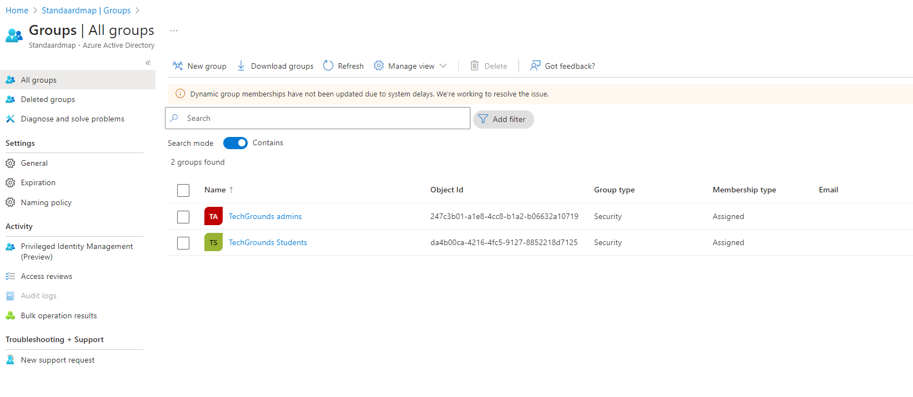
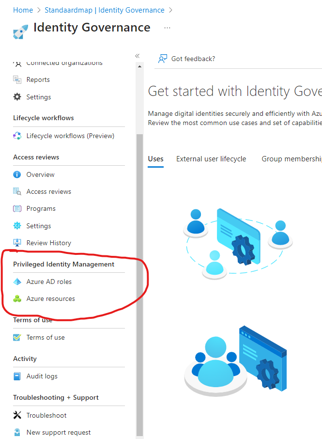
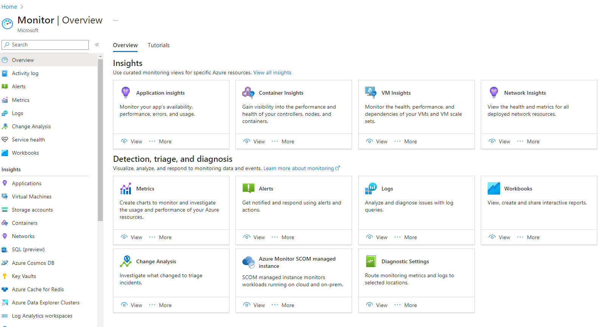
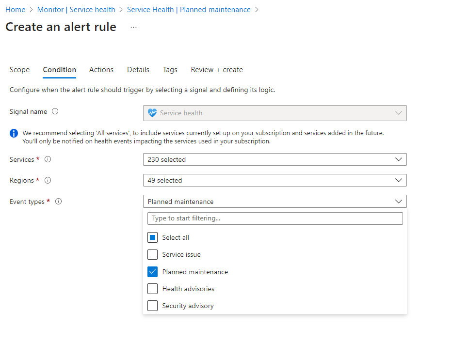

# AZ-15 Praktische zaken
[Geef een korte beschrijving van het onderwerp]

## Key-terms
[Schrijf hier een lijst met belangrijke termen met eventueel een korte uitleg.]

## Opdracht
Vragen voor praktisch onderzoek:
- Waar kan ik deze dienst vinden in de console?
- Hoe zet ik deze dienst aan?
- Hoe kan ik deze dienst koppelen aan andere resources?

- Azure Active Directory			
- Azure Monitor					
- CosmosDB 					
- Azure Functions 			
- Event Grid, Queue Storage, Service Bus

### Gebruikte bronnen
- AAD van de werkomgeving van mijn vriendin. 
- https://www.msp360.com/resources/blog/iam-vs-pam-vs-pim/#:~:text=So%2C%20to%20put%20it%20in,PIM%20cover%20privileged%20access%20patterns.
- https://learn.microsoft.com/en-us/azure/cosmos-db/introduction
- 

### Ervaren problemen
Sommige termen worden nog wel eens door elkaar heen gebruikt bij verschillende sources (IAM, PIM, PAM) en dat schept soms wel wat verwarring. 

### Resultaat

- ### **Azure Active Directory (AAD)**

AAD is bij ons niet heel spannend in de zin dat die vrijwel leeg is. Je kan natuurijk door users en groeps scrollen om beetje uit te vinden hoe het in elkaar steekt en ook welke custom domain we hebben (de @caspertechgrounds.onmicrosoft.com). En dat je bijvoorbeeld zou kunnen kiezen om MFA in te stellen als authenticatie methode. 

De verschillende groups in het AAD van dit Cloud10 cluster. Vrij logisch dat het vrij plat is met 1 admin group en 1 normale usergroup, in dit geval students. 

Belangrijkste is denk ik om te blijven herinneren dat AAD net als een reguliere AD werkt, maar net even wat meer kan omdat er verschillende Azure services mee gekoppeld kunnen worden waarbij AAD als authenticatie en permissie gever werkt. Met dat laatste is het dan ook logisch dat je verschillende rollen kan maken en die rollen kan je dan ook weer stoppen in groupen om ze te clusteren. Hier komt dan ook weer RBAC, IAM en principle of least privilege om de hoek kijken. 

Mijn vriendin werkt op een helpdesk voor een logistiek bedrijf en daar staat het AAD wel aardig gevuld. Ze hebben ook een koppeling met AD connect (want ja, die bedrijven bestonden al voor dat de Cloud een ding werd en dus hebben ze nog ergens een eigen AD) en vele 10.000 users en devices. Het loopt in hun geval ook wel snel op omdat bijvoorbeeld ook apparaten als printers, scanners en beveiligingscamera's ook allemaal in het AAD staan met hun eigen (statische) IP. 

Je ziet bij zo'n bedrijf ook duidelijk de forest en hoeveel branches je wel niet kan hebben met daaronder nog meer branches enzovoort. Wat dat betreft is het Windows Explorer met permissions. 

Hier kreeg ik nog een vraag over op een oefen examen en daarom omcirkel ik dit nog even.  

Heb nog een bron opgedoken want ik vond dat toch wat verrwarrend in combinatie met andere security policies.

**IAM vs PAM vs PIM: The Difference Explained**\
First, let's define these three concepts:

- **Identity and access management (IAM)** – is a framework of policies, and security solutions tied to these policies, that overview and set rules to the access patterns of all users in the given organization for a defined set of resources.
- **Privileged access management (PAM)**– is a framework of policies and security solutions that define access to a defined set of privileged resources.
- **Privileged identity management (PIM**) – is a framework of policies and security solutions that define the access patterns of the privileged users to a defined set of resources.

So, to put it in a nutshell, IAM covers all access patterns for all users and all systems and resources, and PAM and PIM cover privileged access patterns. It might seem as if the last two are identical and, indeed, the formal difference between IAM, PAM and PIM can be ignored when you create your organizational access policies.

Kortom in theorie is het net anders, in de praktijk is vooral belangrijk dat je de policies maakt en beheert dan hoe het precies heet. 

- ### **Azure Monitor**		
Waar kunnen we AZ monitor vinden? Vrij simpel, via zowel het standaard menu aan de linkerkant van de portal als via de zoekfuncties. 

Overzicht van AZ monitor ziet er als boven uit en is een handige tool om insights op te doen en trends te spotten. 

AZ Advisor die we bij de theorie tegen kwamen, is ook als onderdeel van AZ monitor te gebruiken. Advisor blijft zijn ding doen en in 

We gaan geen super deep dive doen wat AZ monitor allemaal kan, maar wat ik persoonlijk wel interessant vond dat die ook alerts kan creeren voor service health en ook planned maintenance. Je maakt eigenlijk event triggers aan. 

Dit speelt natuurlijk ook weer een rol voor waar we het zo over gaan hebben met de Event Grid. 

- ### **CosmosDB**

noSQL db, dus handig voor gigantische bakken data die snel moeten worden geschreven, niet per se een relatie hoeven te hebben en de database zelf moet (snel) schaalbaar kunnen zijn. 

Deeply integrated with key Azure services used in modern (cloud-native) app development including Azure Functions, IoT Hub, AKS (Azure Kubernetes Service), App Service and more. 

- Azure Functions
 		

- Event Grid, Queue Storage, Service Bus