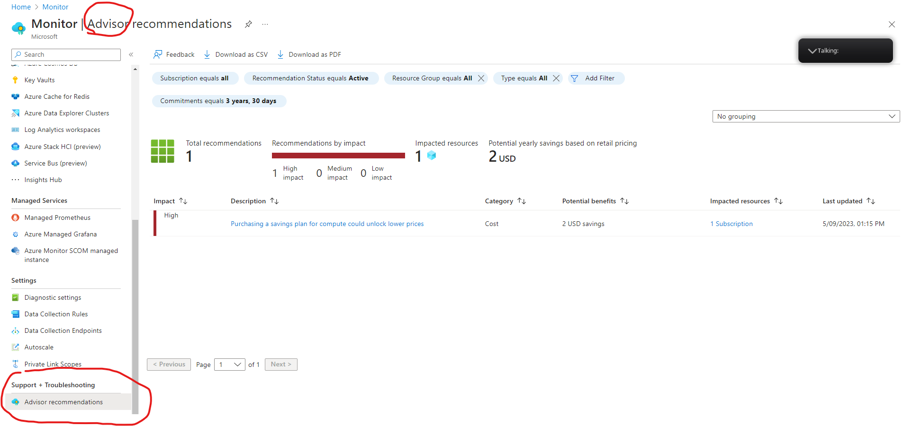

# AZ-15 Praktische zaken
[Geef een korte beschrijving van het onderwerp]

## Key-terms
[Schrijf hier een lijst met belangrijke termen met eventueel een korte uitleg.]

## Opdracht
Vragen voor praktisch onderzoek:
- Waar kan ik deze dienst vinden in de console?
- Hoe zet ik deze dienst aan?
- Hoe kan ik deze dienst koppelen aan andere resources?

- Azure Active Directory			
- Azure Monitor					
- CosmosDB 					
- Azure Functions 			
- Event Grid, Queue Storage, Service Bus

### Gebruikte bronnen
[Plaats hier de bronnen die je hebt gebruikt.]

### Ervaren problemen
[Geef een korte beschrijving van de problemen waar je tegenaan bent gelopen met je gevonden oplossing.]

### Resultaat

- ### **Azure Active Directory**
	

- ### **Azure Monitor**		
Waar kunnen we AZ monitor vinden? Vrij simpel, via zowel het standaard menu aan de linkerkant van de portal als via de zoekfuncties. 

Overzicht van AZ monitor ziet er als boven uit en is een handige tool om insights op te doen en trends te spotten. 

AZ Advisor die we bij de theorie tegen kwamen, is ook als onderdeel van AZ monitor te gebruiken. Advisor blijft zijn ding doen en in 

We gaan geen super deep dive doen wat AZ monitor allemaal kan, maar wat ik persoonlijk wel interessant vond dat die ook alerts kan creeren voor service health en ook planned maintenance. Je maakt eigenlijk event triggers aan. 

Dit speelt natuurlijk ook weer een rol voor waar we het zo over gaan hebben met de Event Grid. 

- CosmosDB 	

- Azure Functions 		

- Event Grid, Queue Storage, Service Bus